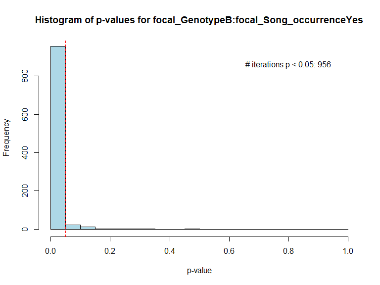
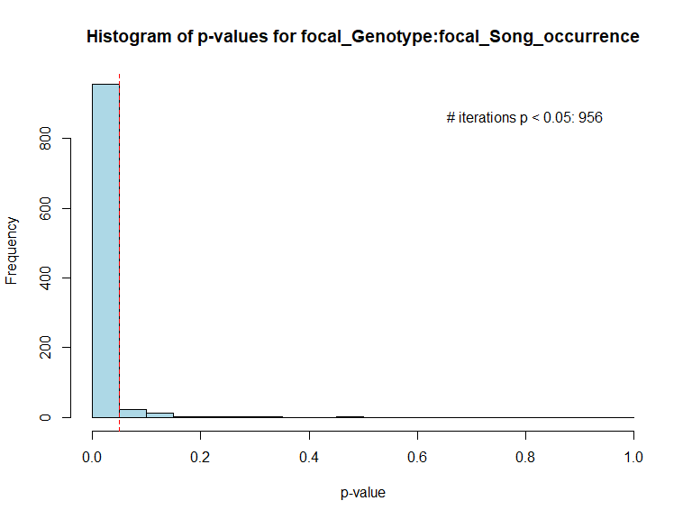
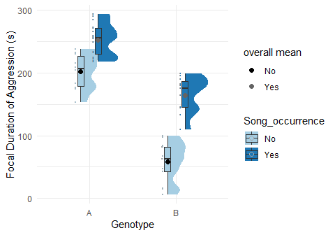

# DyadBoot

DyadBoot is an R package that provides tools for analysing experimental dyad data at the individual level.  Randomly assigns the role of "focal" or "opposite" to each individual of each dyad. Performs bootstrapping of chosen model (currently supports lm, glm, lmer, glmer, and glm.nb), reassigning the "focal" and "opposite" roles at each iteration of the bootstrapping to mitigate sampling bias. Output contains summary tables and Anova tables ('car' package) of all bootstapping iterations. Includes other functions for summary statistics and plotting capabilites (read vignette). ChatGPT-4 was used to generalise original functions in this package.

## Introduction

`DyadBoot` is indicated for experimental data involving dyads, in which effects
want to be explored at the individual level. Input dataframe must be 
strucutred so that each row pertains to one individual of the dyad 
(individuals of the same dyad must be in adjacent rows), and there must 
be one column specifying the Dyad name/ID (e.g. “Dyad_id”). Functions randBoot, 
randOne, and randMult, restructures the dataframe so that there is one row per dyad,
with separate columns for the variables associated with each individual in the dyad.
Role of "focal" and "opposite" are randomly attributed each individual of the dyad. randOne performs this once, while randBoot and randMult perform this the number of times specified by the user. randOne and randMult simply generate the new dataframe(s) while randBoot runs a specified model on each generated dataframe.

Example provided below:

-Example-

Original Data

<table>
<thead>
<tr class="header">
<th style="text-align: left;">Dyad_id</th>
<th style="text-align: right;">Individual</th>
<th style="text-align: left;">Treatment</th>
<th style="text-align: right;">Body_Size</th>
</tr>
</thead>
<tbody>
<tr class="odd">
<td style="text-align: left;">Trial1</td>
<td style="text-align: right;">100</td>
<td style="text-align: left;">High protein</td>
<td style="text-align: right;">0.500</td>
</tr>
<tr class="even">
<td style="text-align: left;">Trial1</td>
<td style="text-align: right;">101</td>
<td style="text-align: left;">Low protein</td>
<td style="text-align: right;">0.433</td>
</tr>
<tr class="odd">
<td style="text-align: left;">Trial2</td>
<td style="text-align: right;">102</td>
<td style="text-align: left;">Low protein</td>
<td style="text-align: right;">0.552</td>
</tr>
<tr class="even">
<td style="text-align: left;">Trial2</td>
<td style="text-align: right;">103</td>
<td style="text-align: left;">High protein</td>
<td style="text-align: right;">0.601</td>
</tr>
<tr class="odd">
<td style="text-align: left;">Trial3</td>
<td style="text-align: right;">104</td>
<td style="text-align: left;">High protein</td>
<td style="text-align: right;">0.342</td>
</tr>
<tr class="even">
<td style="text-align: left;">Trial3</td>
<td style="text-align: right;">105</td>
<td style="text-align: left;">Low protein</td>
<td style="text-align: right;">0.560</td>
</tr>
</tbody>
</table>

With DyadBoot::randOne, DyadBoot::randMult or DyadBoot::randBoot

<table>
<colgroup>
<col style="width: 6%" />
<col style="width: 14%" />
<col style="width: 17%" />
<col style="width: 13%" />
<col style="width: 16%" />
<col style="width: 13%" />
<col style="width: 16%" />
</colgroup>
<thead>
<tr class="header">
<th style="text-align: left;">Dyad_id</th>
<th style="text-align: right;">focal_Individual</th>
<th style="text-align: right;">opposite_Individual</th>
<th style="text-align: left;">focal_Treatment</th>
<th style="text-align: left;">opposite_Treatment</th>
<th style="text-align: right;">focal_Body_Size</th>
<th style="text-align: right;">opposite_Body_Size</th>
</tr>
</thead>
<tbody>
<tr class="odd">
<td style="text-align: left;">Trial1</td>
<td style="text-align: right;">100</td>
<td style="text-align: right;">101</td>
<td style="text-align: left;">High protein</td>
<td style="text-align: left;">Low protein</td>
<td style="text-align: right;">0.500</td>
<td style="text-align: right;">0.433</td>
</tr>
<tr class="even">
<td style="text-align: left;">Trial2</td>
<td style="text-align: right;">102</td>
<td style="text-align: right;">103</td>
<td style="text-align: left;">Low protein</td>
<td style="text-align: left;">High protein</td>
<td style="text-align: right;">0.552</td>
<td style="text-align: right;">0.601</td>
</tr>
<tr class="odd">
<td style="text-align: left;">Trial3</td>
<td style="text-align: right;">104</td>
<td style="text-align: right;">105</td>
<td style="text-align: left;">High protein</td>
<td style="text-align: left;">Low protein</td>
<td style="text-align: right;">0.342</td>
<td style="text-align: right;">0.560</td>
</tr>
</tbody>
</table>

## Installation

Install the package from GitHub using `devtools`:

    install.packages("devtools")
    devtools::install_github("toomanycrickets/DyadBoot")

## Functions:

1.  ‘randBoot’ - Randomly assigns the role of “focal” and “opposite” to
    each individual of each dyad. Bootstrapping is then performed on the
    chosen model (package only supports lm, glm, lmer, and glmer so
    far). The random assignment of “focal” and “ooposite” roles occurs
    at every iteration of the bootstrapping to mitigate random sampling
    bias. The output includes
    “results$bootstrap\_results", a string of all summary tables from each bootstrapping iteration, and "results$anova\_results”,
    a string of all Anova tables from each bootstrapping iteration.

<!-- -->

    model_formula <- dependent_variable ~ independent_variable #specify model formula. It takes the format generated by the randBoot function with the "focal" and "opposite" roles attributed. Example: model_formula <- focal_aggression ~ opposite_mass

    results <- DyadBoot::randBoot(data = data,
                               dyad_id_col = "dyad_id",
                               model_formula = model_formula,
                               model_type = "lm",
                               n_bootstraps = 1000,
                               focal_cols = c("dependent_variable"), 
                               opposite_cols = c("dependent_variable"))

    #"focal_cols" and "opposite_cols" both take the original name of the variable, without the attribution of "focal" or "opposite". Must be same variable. 
    #Example: (...) focal_cols = c("aggression"), 
                   #opposite_cols = c("aggression"))
                   
    results$bootstrap_results #for list of all summary(model) performed in the bootstrapping
    results$anova_results #for list of all car::Anova(model) performed in the bootstrapping

------------------------------------------------------------------------

1.  ‘randOne’ - To only perform the random assignment of roles once, without
    performing the bootstrapping step. Returns a dataset called
    “focal\_opposite\_data”. Useful for testing model assumptions before
    analysis.

<!-- -->

    focal_opposite_data <- DyadBoot::randOne(data = data, dyad_id_col = "your_dyad_column_name")

------------------------------------------------------------------------

1.  ‘randMult’ - To perform the random assignment of roles a specified
    number of times without performing the bootstrapping step. Returns a
    list with all datasets.

<!-- -->

    resultsMult <- randMult(data, dyad_id_col = "your_dyad_column_name", num_iterations = number_of_iterations_desired)

    resultsMult$results_list #access all datasets

------------------------------------------------------------------------

1.  ‘repDataSet’ - Takes ‘randMult’ output as input and chooses the most
    representative dataset for the particular variables specified
    (whereby the mean for that dataset is closest to the overall mean of
    all datasets generated by randMult). Can handle up to three categorical variables.
    Also provides a dataframe that contains the mean for the categorical variable(s) of interested for all
    its levels - for all datasets (the number of rows in this dataframe
    is the number of datasets).

<!-- -->

    rep_data<- DyadBoot::repDataSet(resultsMult, "numerical_variable", "categorical_variable1", "categorical_variable2", "categorical_variable3")

    rep_data$closest_data #access most representative dataset
    rep_data$each_dataset_means #access dataframe with means for each level of the categorical variable for each dataset generated by randMult

------------------------------------------------------------------------

1.  ‘averages’ - Takes the output of DyadBoot::randBoot as input and
    returns a table with the averages of all coeficients (e.g. estimate,
    standard error, z-value, p-value) (for each tested factor) from all
    iterations of the bootstrapping. Also provides standard errors of
    these averages).

<!-- -->

    DyadBoot::averages(results$bootstrap_results)

------------------------------------------------------------------------

1.  ‘anovaPvals’ - Extracts all P-values from the Anova output generated
    by DyadBoot::randBoot (results$anova_results) for the specified
    factor.

<!-- -->

    pvals<-DyadBoot::anovaPvals(results$anova_results, "factor_name")

------------------------------------------------------------------------

1.  ‘MeanOfMeans’ - Calculates the overall mean of all bootstrap
    iterations of a specified numerical variable, for all levels of up to three
    specified categorical variables.

<!-- -->

    overall_means <- DyadBoot::MeanOfMeans(mrep_data$each_dataset_means, "numerical_variable", "categorical_variable1", "categorical_variable2", "categorical_variable3") 

    #each_dataset_means is one of the outputs of DyadBoot::repDataSet, a dataframe that contains the mean for the categorical variable of interested for all its levels - for each dataset generated by DyadBoot::randMult. 

------------------------------------------------------------------------

1.  ‘histMeans’ - Histogram of distribution of means for specified level
    of specified categorical variable.

<!-- -->

    histMeans(each_dataset_means, numerical_variable, categorical_variable, level) #each_dataset_means is one of the outputs of DyadBoot::repDataSet, a dataframe that contains the mean for the categorical variable of interested for all its levels (can be accessed via rep_data$each_dataset_means) - for each dataset generated by DyadBoot::randMult. 

------------------------------------------------------------------------

1.  ‘histPvals’ - Histogram of the distribution of all p-values for the
    selected factor, chose to either use the summary() or Anova() output.
    Text within the plot specifies the number of
    iterations that the selected factor had a significant p-value.

Using output from summary function
<!-- -->
    DyadBoot::histPvals(results$bootstrap_results, "your_coefficient_name", "Summary")

Using output from Anova function
<!-- -->
    DyadBoot::histPvals(results$anova_results, "your_coefficient_name", "Anova")
------------------------------------------------------------------------

1.  -   ‘plotBoot’ - Two grid plot. Left grid -raincloud plot (with
        boxplot) of the most representative dataset with overlay of
        overall mean for the specified variable. Handles up to two
        categorical variables. Right grid - Histogram of pvalues
        with red dashed line at 0.05.

<!-- -->

    plot1<-DyadBoot::plotBoot(rep_data$closest_data, "numerical_variable", "categorical_variable1", "categorical_variable2", overall_means = overall_means, 
                   xlab_name = "name", ylab_name = "name", main_title = "name", p_values = pvals)
                   
    plot1 #to generate plot

    #overall_means is the output of fucntion DyadBoot::MeanOfMeans
    #pvals is list of p-values of factor of interest, output of DyadBoot::anovaPvals.

## Running functions with example data:

Here we use an example ficticious data set on cricket behaviour. "Aggression_Duration" is the dependent variable, and "Genotype" and "Song_occurrence" are the independent variables.

    library(DyadBoot)

    ## Loading required package: lme4

    ## Loading required package: Matrix

    ## Loading required package: car

    ## Loading required package: carData

    ## Loading required package: ggplot2

    ## Loading required package: ggdist

    ## Loading required package: RColorBrewer

    ## Loading required package: cowplot

    head(mydata)

    ##   Individual_ID Trial_ID Genotype Song_occurrence Aggression_Duration
    ## 1             1        1        A             Yes           290.82659
    ## 2             2        1        B             Yes           185.64898
    ## 3             3        2        B              No            42.53736
    ## 4             4        2        B              No            90.65417
    ## 5             5        3        A             Yes           298.56505
    ## 6             6        3        A             Yes           224.20553

    model_formula <- focal_Aggression_Duration ~ focal_Genotype * focal_Song_occurrence #specify model formula. It takes the format generated by the randBoot function with the "focal" and "opposite" roles attributed. It should always include the "focal_" or "opposite_" prefix, if it includes the original variable names, it will not work. Another example would be: model_formula <- focal_aggression ~ opposite_Genotype

    results <- DyadBoot::randBoot(data = mydata,
                                  dyad_id_col = "Trial_ID",
                                  model_formula = model_formula,
                                  model_type = "lm",
                                  n_bootstraps = 1000,
                                  focal_cols = c("Aggression_Duration"), 
                                  opposite_cols = c("Aggression_Duration"))

    #"focal_cols" and "opposite_cols" both take the original name of the variable, without the "focal_" or "opposite_" prefixes. These must be same variable (the dependent variable of interest).
    
    #Another Example: (...) 
    #focal_cols = c("Mating_Frequency"), 
    #opposite_cols = c("Mating_Frequency"))

    head(results$bootstrap_results) #for list of all summary(model) performed in the bootstrapping
    head(results$bootstrap_results[[1]]) # here we'll only visualise one row

    ## [[1]]
    ## [[1]]$model
    ## 
    ## Call:
    ## lm(formula = model_formula, data = focal_opposite_data)
    ## 
    ## Coefficients:
    ##                              (Intercept)                           focal_GenotypeB  
    ##                                   192.53                                   -135.42  
    ##                 focal_Song_occurrenceYes  focal_GenotypeB:focal_Song_occurrenceYes  
    ##                                    51.82                                     61.41  
    ## 
    ## 
    ## [[1]]$summary
    ## 
    ## Call:
    ## lm(formula = model_formula, data = focal_opposite_data)
    ## 
    ## Residuals:
    ##     Min      1Q  Median      3Q     Max 
    ## -51.284 -23.416  -0.669  19.081  52.319 
    ## 
    ## Coefficients:
    ##                                          Estimate Std. Error t value Pr(>|t|)    
    ## (Intercept)                                192.53       8.87  21.705  < 2e-16 ***
    ## focal_GenotypeB                           -135.42      11.80 -11.478 4.24e-15 ***
    ## focal_Song_occurrenceYes                    51.82      11.61   4.462 5.21e-05 ***
    ## focal_GenotypeB:focal_Song_occurrenceYes    61.41      16.00   3.839 0.000376 ***
    ## ---
    ## Signif. codes:  0 '***' 0.001 '**' 0.01 '*' 0.05 '.' 0.1 ' ' 1
    ## 
    ## Residual standard error: 28.05 on 46 degrees of freedom
    ## Multiple R-squared:  0.8724, Adjusted R-squared:  0.864 
    ## F-statistic: 104.8 on 3 and 46 DF,  p-value: < 2.2e-16
    

    head(results$anova_results) #for list of all car::Anova(model) performed in the bootstrapping
    head(results$anova_results[[1]]) # here we'll only visualise one row

    ## [[1]]
    ## Anova Table (Type II tests)
    ## 
    ## Response: focal_Aggression_Duration
    ##                                      Sum Sq Df F value    Pr(>F)    
    ## focal_Genotype                       128988  1 163.950 < 2.2e-16 ***
    ## focal_Song_occurrence                 87409  1 111.101 7.431e-14 ***
    ## focal_Genotype:focal_Song_occurrence  11594  1  14.736 0.0003759 ***
    ## Residuals                             36191 46                      
    ## ---
    ## Signif. codes:  0 '***' 0.001 '**' 0.01 '*' 0.05 '.' 0.1 ' ' 1
    

    DyadBoot::averages(results$bootstrap_results)

    ## $averages
    ##                                            Estimate Std. Error    t value     Pr(>|t|)
    ## (Intercept)                               202.30925   9.097815  22.452777 9.678681e-21
    ## focal_GenotypeB                          -144.50899  12.380200 -11.704123 2.936677e-13
    ## focal_Song_occurrenceYes                   49.90454  11.720332   4.278912 5.374046e-04
    ## focal_GenotypeB:focal_Song_occurrenceYes   56.19306  16.978888   3.326088 1.065578e-02
    ## 
    ## $standard_errors
    ##                                           Estimate Std. Error    t value     Pr(>|t|)
    ## (Intercept)                              0.1562721 0.02809631 0.07248204 9.502603e-21
    ## focal_GenotypeB                          0.2626789 0.02003648 0.02889479 2.319444e-13
    ## focal_Song_occurrenceYes                 0.2312214 0.02777540 0.02185243 4.537238e-05
    ## focal_GenotypeB:focal_Song_occurrenceYes 0.3921393 0.02726897 0.02508711 9.778028e-04

histPvals - From summary() or car::Anova() output

    DyadBoot::histPvals(results$bootstrap_results, coeff_name = "focal_GenotypeB:focal_Song_occurrenceYes", "Summary")

    DyadBoot::histPvals(results$anova_results, coeff_name = "focal_Genotype:focal_Song_occurrence", "Anova")

From car::Anova() function

    pvals<-DyadBoot::anovaPvals(results$anova_results, "focal_Genotype:focal_Song_occurrence")
    head(pvals)

    ## [[1]]
    ## [1] 0.000375887
    ## 
    ## [[2]]
    ## [1] 7.804806e-05
    ## 
    ## [[3]]
    ## [1] 0.00134162
    ## 
    ## [[4]]
    ## [1] 4.10234e-05
    ## 
    ## [[5]]
    ## [1] 0.0002771581
    ## 
    ## [[6]]
    ## [1] 0.0003735079
    

    resultsMult <- DyadBoot::randMult(mydata, dyad_id_col = "Trial_ID", num_iterations = 1000)

    

    rep_data<- DyadBoot::repDataSet(resultsMult, "focal_Aggression_Duration", "focal_Genotype", "focal_Song_occurrence")

    head(rep_data$closest_data) #access most representative dataset

    ##   focal_Individual_ID focal_Trial_ID focal_Genotype focal_Song_occurrence
    ## 1                   1              1              A                   Yes
    ## 2                   3              2              B                    No
    ## 3                   6              3              A                   Yes
    ## 4                   8              4              B                    No
    ## 5                   9              5              B                    No
    ## 6                  12              6              B                   Yes
    ##   focal_Aggression_Duration opposite_Individual_ID opposite_Trial_ID opposite_Genotype
    ## 1                290.826589                      2                 1                 B
    ## 2                 42.537357                      4                 2                 B
    ## 3                224.205527                      5                 3                 A
    ## 4                 46.972332                      7                 4                 A
    ## 5                  5.819067                     10                 5                 B
    ## 6                164.328822                     11                 6                 A
    ##   opposite_Song_occurrence opposite_Aggression_Duration
    ## 1                      Yes                    185.64898
    ## 2                       No                     90.65417
    ## 3                      Yes                    298.56505
    ## 4                       No                    243.61548
    ## 5                       No                     12.05803
    ## 6                      Yes                    236.77831

    head(rep_data$each_dataset_means) #access dataframe with means for each level of the categorical variable for each dataset generated by randMult

    ##   Iteration focal_Aggression_Duration focal_Genotype focal_Song_occurrence
    ## 1         1                 194.38601              A                    No
    ## 2         1                  55.67109              B                    No
    ## 3         1                 246.81909              A                   Yes
    ## 4         1                 158.12696              B                   Yes
    ## 5         2                 204.81258              A                    No
    ## 6         2                  57.53611              B                    No

    overall_means <- DyadBoot::MeanOfMeans(rep_data$each_dataset_means, "focal_Aggression_Duration", "focal_Genotype", "focal_Song_occurrence") 
    head(overall_means)

    ##   focal_Genotype focal_Song_occurrence focal_Aggression_Duration
    ## 1              A                    No                 202.28185
    ## 2              B                    No                  58.12274
    ## 3              A                   Yes                 252.54342
    ## 4              B                   Yes                 164.01914

Without p-values

    plot <- DyadBoot::plotBoot(rep_data$closest_data, "focal_Aggression_Duration", "focal_Genotype", "focal_Song_occurrence", overall_means = overall_means, 
                                xlab_name = "Genotype", ylab_name = "Focal Duration of Aggression (s)", main_title = NULL)

    plot #to generate plot

With p-values - use either plotBoot or plotBoot1 (width parameters
differ)

    plot1 <- DyadBoot::plotBoot1(rep_data$closest_data, "focal_Aggression_Duration", "focal_Genotype", "focal_Song_occurrence", overall_means = overall_means, 
                                xlab_name = "Genotype", ylab_name = "Focal Duration of Aggression (s)", main_title = NULL, p_values = pvals)

    plot1 #to generate plot

------------------------------------------------------------------------
