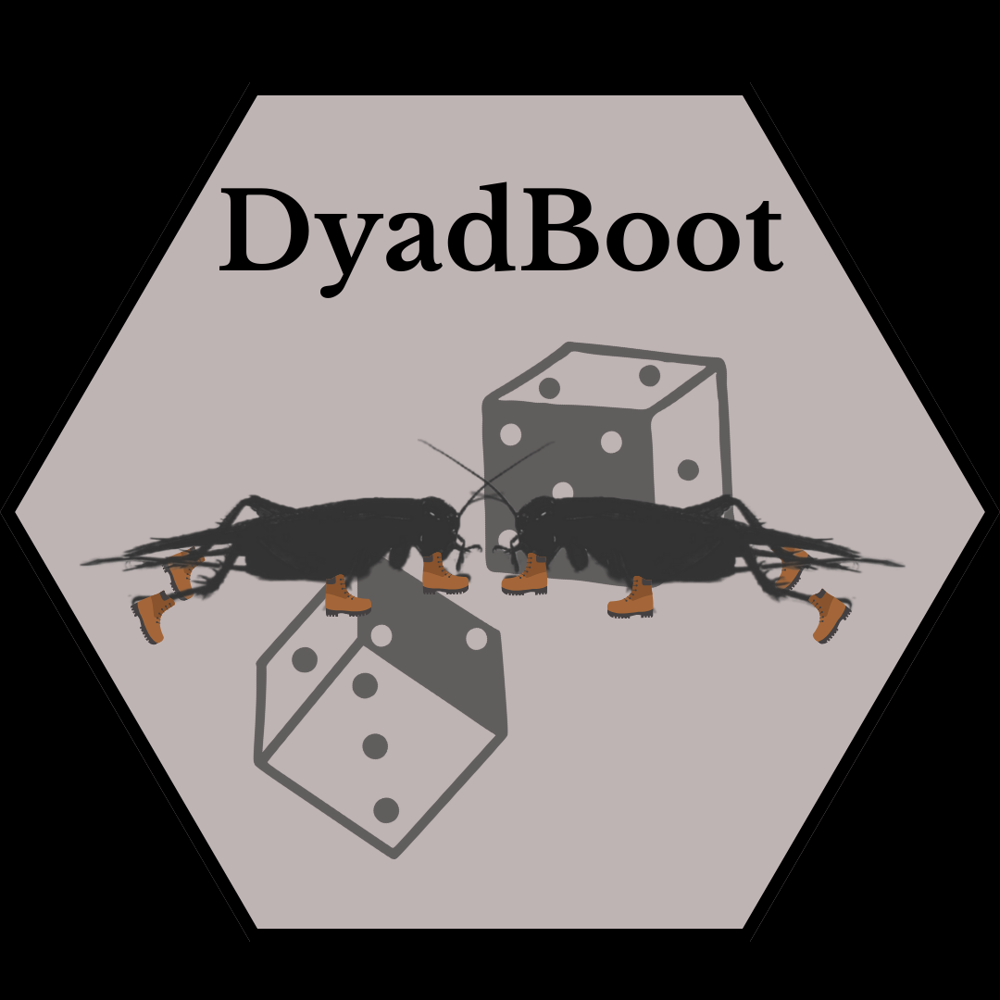

# DyadBoot

R package that provides tools for analysing experimental dyad data at the individual level. Randomly assigns the role of "focal" or "opposite" to each individual of each dyad. Performs bootstrapping of chosen model (so far only supports lm, glm, lmer, and glmer), reassigning the "focal" and "opposite" roles at each iteration of the bootstrapping to mitigate sampling bias. Output contains summary tables and Anova tables ('car' package) of all bootstapping iterations. Includes other functions for summary statistics and plotting capabilites (read vignette).

## Introduction

`DyadBoot` provides tools for dyadic random bootstrapping and analysis.
It is indicated for experimental data involving dyads, in which effects
want to be explored at the individual level. It is important to note
that it requires 1) there to be a column pertaining to the Dyad
(e.g. “Dyad\_id”), 2) that each invidual is on a different row, and 3)
for individuals belonging to the same dyad to be in adjecent rows.
Example provided below:

-Example-

Original Data

    library(knitr)

    data <- data.frame(
      Dyad_id = c("Trial1", "Trial1", "Trial2", "Trial2", "Trial3", "Trial3"),
      Individual = c(100, 101, 102, 103, 104, 105),
      Treatment = c("High protein", "Low protein", "Low protein", "High protein", "High protein", "Low protein"),
      `Body mass (g)` = c(0.5, 0.433, 0.552, 0.601, 0.342, 0.56)
    )

    kable(data)

<table>
<thead>
<tr class="header">
<th style="text-align: left;">Dyad_id</th>
<th style="text-align: right;">Individual</th>
<th style="text-align: left;">Treatment</th>
<th style="text-align: right;">Body.mass..g.</th>
</tr>
</thead>
<tbody>
<tr class="odd">
<td style="text-align: left;">Trial1</td>
<td style="text-align: right;">100</td>
<td style="text-align: left;">High protein</td>
<td style="text-align: right;">0.500</td>
</tr>
<tr class="even">
<td style="text-align: left;">Trial1</td>
<td style="text-align: right;">101</td>
<td style="text-align: left;">Low protein</td>
<td style="text-align: right;">0.433</td>
</tr>
<tr class="odd">
<td style="text-align: left;">Trial2</td>
<td style="text-align: right;">102</td>
<td style="text-align: left;">Low protein</td>
<td style="text-align: right;">0.552</td>
</tr>
<tr class="even">
<td style="text-align: left;">Trial2</td>
<td style="text-align: right;">103</td>
<td style="text-align: left;">High protein</td>
<td style="text-align: right;">0.601</td>
</tr>
<tr class="odd">
<td style="text-align: left;">Trial3</td>
<td style="text-align: right;">104</td>
<td style="text-align: left;">High protein</td>
<td style="text-align: right;">0.342</td>
</tr>
<tr class="even">
<td style="text-align: left;">Trial3</td>
<td style="text-align: right;">105</td>
<td style="text-align: left;">Low protein</td>
<td style="text-align: right;">0.560</td>
</tr>
</tbody>
</table>

With DyadBoot::randOne, DyadBoot::randMult or DyadBoot::randBoot

    library(knitr)

    data <- data.frame(
      Dyad_id = c("Trial1", "Trial2", "Trial3"),
      focal_Individual = c(100, 102, 104),
      opposite_Individual = c(101, 103, 105),
      focal_Treatment = c("High protein", "Low protein", "High protein"),
      opposite_Treatment = c("Low protein", "High protein", "Low protein"),
      focal_Body_Size = c(0.5, 0.552, 0.342),
      opposite_Body_Size = c(0.433, 0.601, 0.56)
    )

    kable(data)

<table>
<colgroup>
<col style="width: 6%" />
<col style="width: 14%" />
<col style="width: 17%" />
<col style="width: 13%" />
<col style="width: 16%" />
<col style="width: 13%" />
<col style="width: 16%" />
</colgroup>
<thead>
<tr class="header">
<th style="text-align: left;">Dyad_id</th>
<th style="text-align: right;">focal_Individual</th>
<th style="text-align: right;">opposite_Individual</th>
<th style="text-align: left;">focal_Treatment</th>
<th style="text-align: left;">opposite_Treatment</th>
<th style="text-align: right;">focal_Body_Size</th>
<th style="text-align: right;">opposite_Body_Size</th>
</tr>
</thead>
<tbody>
<tr class="odd">
<td style="text-align: left;">Trial1</td>
<td style="text-align: right;">100</td>
<td style="text-align: right;">101</td>
<td style="text-align: left;">High protein</td>
<td style="text-align: left;">Low protein</td>
<td style="text-align: right;">0.500</td>
<td style="text-align: right;">0.433</td>
</tr>
<tr class="even">
<td style="text-align: left;">Trial2</td>
<td style="text-align: right;">102</td>
<td style="text-align: right;">103</td>
<td style="text-align: left;">Low protein</td>
<td style="text-align: left;">High protein</td>
<td style="text-align: right;">0.552</td>
<td style="text-align: right;">0.601</td>
</tr>
<tr class="odd">
<td style="text-align: left;">Trial3</td>
<td style="text-align: right;">104</td>
<td style="text-align: right;">105</td>
<td style="text-align: left;">High protein</td>
<td style="text-align: left;">Low protein</td>
<td style="text-align: right;">0.342</td>
<td style="text-align: right;">0.560</td>
</tr>
</tbody>
</table>

## Installation

You can install the package from GitHub using `devtools`:

    install.packages("devtools")
    devtools::install_github("toomanycrickets/DyadBoot")

## Functions:

1.  ‘randBoot’ - Randomly assigns the role of “focal” and “opposite” to
    each individual of each dyad. Bootstrapping is then performed on the
    chosen model (package only supports lm, glm, lmer, and glmer so
    far). The random assignment of “focal” and “ooposite” roles occurs
    at every iteration of the bootstrapping to mitigate random sampling
    bias. The output includes
    “results$bootstrap\_results", a string of all summary tables from each bootstrapping iteration, and "results$anova\_results”,
    a string of all Anova tables from each bootstrapping iteration.

<!-- -->

    model_formula <- dependent_variable ~ independent_variable #specify model formula. It takes the format generated by the randBoot function with the "focal" and "opposite" roles attributed. Example: model_formula <- focal_aggression ~ opposite_mass

    results <- DyadBoot::randBoot(data = data,
                               dyad_id_col = "dyad_id",
                               model_formula = model_formula,
                               model_type = "lm",
                               n_bootstraps = 1000,
                               focal_cols = c("dependent_variable"), 
                               opposite_cols = c("dependent_variable"))

    #"focal_cols" and "opposite_cols" both take the original name of the variable, without the attribution of "focal" or "opposite". Must be same variable. 
    #Example: (...) focal_cols = c("aggression"), 
                   #opposite_cols = c("aggression"))
                   
    results$bootstrap_results #for list of all summary(model) performed in the bootstrapping
    results$anova_results #for list of all car::Anova(model) performed in the bootstrapping

------------------------------------------------------------------------

1.  ‘randOne’ - To only perform the random assignment of roles without
    performing the bootstrapping step. Returns a dataset called
    “focal\_opposite\_data”. Useful for testing model assumptions before
    analysis.

<!-- -->

    focal_opposite_data <- DyadBoot::randOne(data = data, dyad_id_col = "your_dyad_column_name")

------------------------------------------------------------------------

1.  ‘randMult’ - To perform the random assignment of roles a specified
    number of times without performing the bootstrapping step. Returns a
    list with all datasets.

<!-- -->

    resultsMult <- randMult(data, dyad_id_col = "your_dyad_column_name", num_iterations = number_of_iterations_desired)

    resultsMult$results_list #access all datasets

------------------------------------------------------------------------

1.  ‘repDataSet’ - Takes ‘randMult’ output as input and chooses the most
    representative dataset for the particular variables specified
    (whereby the mean for that dataset is closest to the overall mean of
    all datasets generated by randMult). Also provides a dataframe that
    contains the mean for the categorical variable of interested for all
    its levels - for all datasets (the number of rows in this dataframe
    is the number of datasets. The number of columns is the number of
    levels of the categorical variable).

<!-- -->

    rep_data<- DyadBoot::repDataSet(resultsMult, "numerical_variable", "categorical_variable1", "categorical_variable2")

    rep_data$closest_data #access most representative dataset
    rep_data$each_dataset_means #access dataframe with means for each level of the categorical variable for each dataset generated by randMult

------------------------------------------------------------------------

1.  ‘averages’ - Takes the output of DyadBoot::randBoot as input and
    returns a table with the averages of all coeficients (e.g. estimate,
    standard error, z-value, p-value) (for each tested factor) from all
    iterations of the bootstrapping. Also provides standard errors of
    these averages).

<!-- -->

    DyadBoot::averages(results$bootstrap_results)

------------------------------------------------------------------------

1.  ‘anovaPvals’ - Extracts all P-values from the Anova output generated
    by DyadBoot::randBoot (results$anova\_results) for the specified
    factor.

<!-- -->

    pvals<-DyadBoot::anovaPvals(results$anova_results, "factor_name")

------------------------------------------------------------------------

1.  ‘MeanOfMeans’ - Calculates the overall mean of all bootstrap
    iterations of a specified numerical variable for all levels of a
    specified categorical variable.

<!-- -->

    overall_means <- DyadBoot::MeanOfMeans(mrep_data$each_dataset_means, "numerical_variable", "categorical_variable1", "categorical_variable2") 

    #each_dataset_means is one of the outputs of DyadBoot::repDataSet, a dataframe that contains the mean for the categorical variable of interested for all its levels - for each dataset generated by DyadBoot::randMult. 

------------------------------------------------------------------------

1.  ‘histMeans’ - Histogram of distribution of means for specified level
    of specified categorical variable.

<!-- -->

    histMeans(each_dataset_means, numerical_variable, categorical_variable, level) #each_dataset_means is one of the outputs of DyadBoot::repDataSet, a dataframe that contains the mean for the categorical variable of interested for all its levels (can be accessed via rep_data$each_dataset_means) - for each dataset generated by DyadBoot::randMult. 

------------------------------------------------------------------------

1.  ‘histPvals’ - Histogram of the distribution of all p-values for the
    selected factor. Text within the plot specifies the number of
    iterations that the selected factor had a significant p-value.

<!-- -->

    DyadBoot::histPvals(results$bootstrap_results, coeff_name = "your_coefficient_name")

------------------------------------------------------------------------

1.  -   ‘plotBoot’ - Two grid plot. Left grid -raincloud plot (with
        boxplot) of the most representative dataset with overlay of
        overall mean for the specified variable. Right grid - Histogram
        of pvalues with red dashed line at 0.05.

<!-- -->

    plot1<-DyadBoot::plotBoot(rep_data$closest_data, "numerical_variable", "categorical_variable1", "categorical_variable2", overall_means = overall_means, 
                   xlab_name = "name", ylab_name = "name", main_title = "name", p_values = pvals)
                   
    plot1 #to generate plot

    #overall_means is the output of fucntion DyadBoot::MeanOfMeans
    #pvals is list of p-values of factor of interest, output of DyadBoot::anovaPvals.

------------------------------------------------------------------------
