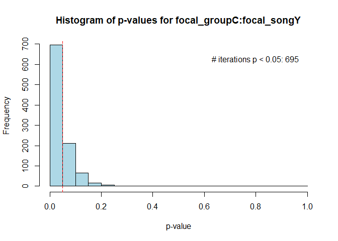
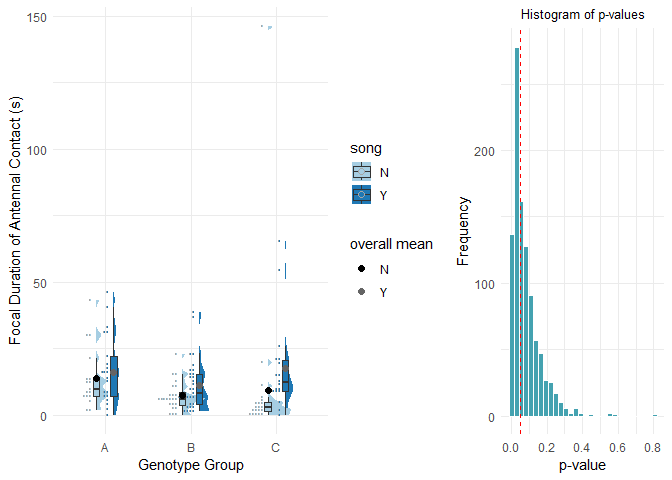

## Introduction

`DyadBoot` provides tools for dyadic random bootstrapping and analysis.
It is indicated for experimental data involving dyads, in which effects
want to be explored at the individual level. It is important to note
that it requires 1) there to be a column pertaining to the Dyad
(e.g. “Dyad\_id”), 2) that each invidual is on a different row, and 3)
for individuals belonging to the same dyad to be in adjecent rows.
Example provided below:

-Example-

Original Data

    library(knitr)

    data <- data.frame(
      Dyad_id = c("Trial1", "Trial1", "Trial2", "Trial2", "Trial3", "Trial3"),
      Individual = c(100, 101, 102, 103, 104, 105),
      Treatment = c("High protein", "Low protein", "Low protein", "High protein", "High protein", "Low protein"),
      `Body mass (g)` = c(0.5, 0.433, 0.552, 0.601, 0.342, 0.56)
    )

    kable(data)

<table>
<thead>
<tr class="header">
<th style="text-align: left;">Dyad_id</th>
<th style="text-align: right;">Individual</th>
<th style="text-align: left;">Treatment</th>
<th style="text-align: right;">Body.mass..g.</th>
</tr>
</thead>
<tbody>
<tr class="odd">
<td style="text-align: left;">Trial1</td>
<td style="text-align: right;">100</td>
<td style="text-align: left;">High protein</td>
<td style="text-align: right;">0.500</td>
</tr>
<tr class="even">
<td style="text-align: left;">Trial1</td>
<td style="text-align: right;">101</td>
<td style="text-align: left;">Low protein</td>
<td style="text-align: right;">0.433</td>
</tr>
<tr class="odd">
<td style="text-align: left;">Trial2</td>
<td style="text-align: right;">102</td>
<td style="text-align: left;">Low protein</td>
<td style="text-align: right;">0.552</td>
</tr>
<tr class="even">
<td style="text-align: left;">Trial2</td>
<td style="text-align: right;">103</td>
<td style="text-align: left;">High protein</td>
<td style="text-align: right;">0.601</td>
</tr>
<tr class="odd">
<td style="text-align: left;">Trial3</td>
<td style="text-align: right;">104</td>
<td style="text-align: left;">High protein</td>
<td style="text-align: right;">0.342</td>
</tr>
<tr class="even">
<td style="text-align: left;">Trial3</td>
<td style="text-align: right;">105</td>
<td style="text-align: left;">Low protein</td>
<td style="text-align: right;">0.560</td>
</tr>
</tbody>
</table>

With DyadBoot::randOne, DyadBoot::randMult or DyadBoot::randBoot

    library(knitr)

    data <- data.frame(
      Dyad_id = c("Trial1", "Trial2", "Trial3"),
      focal_Individual = c(100, 102, 104),
      opposite_Individual = c(101, 103, 105),
      focal_Treatment = c("High protein", "Low protein", "High protein"),
      opposite_Treatment = c("Low protein", "High protein", "Low protein"),
      focal_Body_Size = c(0.5, 0.552, 0.342),
      opposite_Body_Size = c(0.433, 0.601, 0.56)
    )

    kable(data)

<table>
<colgroup>
<col style="width: 6%" />
<col style="width: 14%" />
<col style="width: 17%" />
<col style="width: 13%" />
<col style="width: 16%" />
<col style="width: 13%" />
<col style="width: 16%" />
</colgroup>
<thead>
<tr class="header">
<th style="text-align: left;">Dyad_id</th>
<th style="text-align: right;">focal_Individual</th>
<th style="text-align: right;">opposite_Individual</th>
<th style="text-align: left;">focal_Treatment</th>
<th style="text-align: left;">opposite_Treatment</th>
<th style="text-align: right;">focal_Body_Size</th>
<th style="text-align: right;">opposite_Body_Size</th>
</tr>
</thead>
<tbody>
<tr class="odd">
<td style="text-align: left;">Trial1</td>
<td style="text-align: right;">100</td>
<td style="text-align: right;">101</td>
<td style="text-align: left;">High protein</td>
<td style="text-align: left;">Low protein</td>
<td style="text-align: right;">0.500</td>
<td style="text-align: right;">0.433</td>
</tr>
<tr class="even">
<td style="text-align: left;">Trial2</td>
<td style="text-align: right;">102</td>
<td style="text-align: right;">103</td>
<td style="text-align: left;">Low protein</td>
<td style="text-align: left;">High protein</td>
<td style="text-align: right;">0.552</td>
<td style="text-align: right;">0.601</td>
</tr>
<tr class="odd">
<td style="text-align: left;">Trial3</td>
<td style="text-align: right;">104</td>
<td style="text-align: right;">105</td>
<td style="text-align: left;">High protein</td>
<td style="text-align: left;">Low protein</td>
<td style="text-align: right;">0.342</td>
<td style="text-align: right;">0.560</td>
</tr>
</tbody>
</table>

## Installation

You can install the package from GitHub using `devtools`:

    install.packages("devtools")
    devtools::install_github("toomanycrickets/DyadBoot")

## Functions:

1.  ‘randBoot’ - Randomly assigns the role of “focal” and “opposite” to
    each individual of each dyad. Bootstrapping is then performed on the
    chosen model (package only supports lm, glm, lmer, and glmer so
    far). The random assignment of “focal” and “ooposite” roles occurs
    at every iteration of the bootstrapping to mitigate random sampling
    bias. The output includes
    “results$bootstrap\_results", a string of all summary tables from each bootstrapping iteration, and "results$anova\_results”,
    a string of all Anova tables from each bootstrapping iteration.

<!-- -->

    model_formula <- dependent_variable ~ independent_variable #specify model formula. It takes the format generated by the randBoot function with the "focal" and "opposite" roles attributed. Example: model_formula <- focal_aggression ~ opposite_mass

    results <- DyadBoot::randBoot(data = data,
                               dyad_id_col = "dyad_id",
                               model_formula = model_formula,
                               model_type = "lm",
                               n_bootstraps = 1000,
                               focal_cols = c("dependent_variable"), 
                               opposite_cols = c("dependent_variable"))

    #"focal_cols" and "opposite_cols" both take the original name of the variable, without the attribution of "focal" or "opposite". Must be same variable. 
    #Example: (...) focal_cols = c("aggression"), 
                   #opposite_cols = c("aggression"))
                   
    results$bootstrap_results #for list of all summary(model) performed in the bootstrapping
    results$anova_results #for list of all car::Anova(model) performed in the bootstrapping

------------------------------------------------------------------------

1.  ‘randOne’ - To only perform the random assignment of roles without
    performing the bootstrapping step. Returns a dataset called
    “focal\_opposite\_data”. Useful for testing model assumptions before
    analysis.

<!-- -->

    focal_opposite_data <- DyadBoot::randOne(data = data, dyad_id_col = "your_dyad_column_name")

------------------------------------------------------------------------

1.  ‘randMult’ - To perform the random assignment of roles a specified
    number of times without performing the bootstrapping step. Returns a
    list with all datasets.

<!-- -->

    resultsMult <- randMult(data, dyad_id_col = "your_dyad_column_name", num_iterations = number_of_iterations_desired)

    resultsMult$results_list #access all datasets

------------------------------------------------------------------------

1.  ‘repDataSet’ - Takes ‘randMult’ output as input and chooses the most
    representative dataset for the particular variables specified
    (whereby the mean for that dataset is closest to the overall mean of
    all datasets generated by randMult). Also provides a dataframe that
    contains the mean for the categorical variable of interested for all
    its levels - for all datasets (the number of rows in this dataframe
    is the number of datasets. The number of columns is the number of
    levels of the categorical variable).

<!-- -->

    rep_data<- DyadBoot::repDataSet(resultsMult, "numerical_variable", "categorical_variable1", "categorical_variable2")

    rep_data$closest_data #access most representative dataset
    rep_data$each_dataset_means #access dataframe with means for each level of the categorical variable for each dataset generated by randMult

------------------------------------------------------------------------

1.  ‘averages’ - Takes the output of DyadBoot::randBoot as input and
    returns a table with the averages of all coeficients (e.g. estimate,
    standard error, z-value, p-value) (for each tested factor) from all
    iterations of the bootstrapping. Also provides standard errors of
    these averages).

<!-- -->

    DyadBoot::averages(results$bootstrap_results)

------------------------------------------------------------------------

1.  ‘anovaPvals’ - Extracts all P-values from the Anova output generated
    by DyadBoot::randBoot (results$anova\_results) for the specified
    factor.

<!-- -->

    pvals<-DyadBoot::anovaPvals(results$anova_results, "factor_name")

------------------------------------------------------------------------

1.  ‘MeanOfMeans’ - Calculates the overall mean of all bootstrap
    iterations of a specified numerical variable for all levels of a
    specified categorical variable.

<!-- -->

    overall_means <- DyadBoot::MeanOfMeans(mrep_data$each_dataset_means, "numerical_variable", "categorical_variable1", "categorical_variable2") 

    #each_dataset_means is one of the outputs of DyadBoot::repDataSet, a dataframe that contains the mean for the categorical variable of interested for all its levels - for each dataset generated by DyadBoot::randMult. 

------------------------------------------------------------------------

1.  ‘histMeans’ - Histogram of distribution of means for specified level
    of specified categorical variable.

<!-- -->

    histMeans(each_dataset_means, numerical_variable, categorical_variable, level) #each_dataset_means is one of the outputs of DyadBoot::repDataSet, a dataframe that contains the mean for the categorical variable of interested for all its levels (can be accessed via rep_data$each_dataset_means) - for each dataset generated by DyadBoot::randMult. 

------------------------------------------------------------------------

1.  ‘histPvals’ - Histogram of the distribution of all p-values for the
    selected factor. Text within the plot specifies the number of
    iterations that the selected factor had a significant p-value.

<!-- -->

    DyadBoot::histPvals(results$bootstrap_results, coeff_name = "your_coefficient_name")

------------------------------------------------------------------------

1.  -   ‘plotBoot’ - Two grid plot. Left grid -raincloud plot (with
        boxplot) of the most representative dataset with overlay of
        overall mean for the specified variable. Right grid - Histogram
        of pvalues with red dashed line at 0.05.

<!-- -->

    plot1<-DyadBoot::plotBoot(rep_data$closest_data, "numerical_variable", "categorical_variable1", "categorical_variable2", overall_means = overall_means, 
                   xlab_name = "name", ylab_name = "name", main_title = "name", p_values = pvals)
                   
    plot1 #to generate plot

    #overall_means is the output of fucntion DyadBoot::MeanOfMeans
    #pvals is list of p-values of factor of interest, output of DyadBoot::anovaPvals.

## Running functions with example data:

    library(DyadBoot)
    data("mydata", package = "DyadBoot")
    # Check if the dataset is loaded correctly
    if (!exists("mydata")) {
      stop("The 'mydata' dataset could not be loaded.")
    }
    head(mydata)

    ##   dyad_id group song ind tmass morph line dant  dantlog
    ## 1 AN1.1.3     A    N 164 0.703    Nw    1  7.4 2.128232
    ## 2 AN1.1.3     A    N 165 0.516    Nw    1 17.4 2.912351
    ## 3 AN1.5.1     A    N 503 0.613    Nw    5 24.8 3.250374
    ## 4 AN1.5.1     A    N 108 0.467    Nw    1 29.8 3.427515
    ## 5 AN1.5.2     A    N 101 0.411    Nw    1  9.6 2.360854
    ## 6 AN1.5.2     A    N 501 0.515    Nw    5 10.0 2.397895

    mydata$dantlog <- log(mydata$dant + 1)

    model_formula <- focal_dantlog ~ focal_group * focal_song #specify model formula. It takes the format generated by the randBoot function with the "focal" and "opposite" roles attributed. Example: model_formula <- focal_aggression ~ opposite_mass

    results <- DyadBoot::randBoot(data = mydata,
                                  dyad_id_col = "dyad_id",
                                  model_formula = model_formula,
                                  model_type = "lm",
                                  n_bootstraps = 1000,
                                  focal_cols = c("dantlog"), 
                                  opposite_cols = c("dantlog"))

    #"focal_cols" and "opposite_cols" both take the original name of the variable, without the attribution of "focal" or "opposite". Must be same variable. 
    #Example: (...) focal_cols = c("aggression"), 
    #opposite_cols = c("aggression"))

    head(results$bootstrap_results) #for list of all summary(model) performed in the bootstrapping

    ## [[1]]
    ## [[1]]$model
    ## 
    ## Call:
    ## lm(formula = model_formula, data = focal_opposite_data)
    ## 
    ## Coefficients:
    ##              (Intercept)              focal_groupB              focal_groupC  
    ##                   2.3846                   -0.5435                   -0.8414  
    ##              focal_songY  focal_groupB:focal_songY  focal_groupC:focal_songY  
    ##                   0.1284                    0.2387                    1.0817  
    ## 
    ## 
    ## [[1]]$summary
    ## 
    ## Call:
    ## lm(formula = model_formula, data = focal_opposite_data)
    ## 
    ## Residuals:
    ##      Min       1Q   Median       3Q      Max 
    ## -2.02588 -0.47535  0.07585  0.54078  2.29406 
    ## 
    ## Coefficients:
    ##                          Estimate Std. Error t value Pr(>|t|)    
    ## (Intercept)                2.3846     0.2081  11.461  < 2e-16 ***
    ## focal_groupB              -0.5435     0.2719  -1.999  0.04780 *  
    ## focal_groupC              -0.8414     0.2830  -2.973  0.00354 ** 
    ## focal_songY                0.1284     0.2799   0.459  0.64710    
    ## focal_groupB:focal_songY   0.2387     0.3643   0.655  0.51355    
    ## focal_groupC:focal_songY   1.0817     0.3950   2.739  0.00707 ** 
    ## ---
    ## Signif. codes:  0 '***' 0.001 '**' 0.01 '*' 0.05 '.' 0.1 ' ' 1
    ## 
    ## Residual standard error: 0.8578 on 125 degrees of freedom
    ## Multiple R-squared:  0.1775, Adjusted R-squared:  0.1445 
    ## F-statistic: 5.393 on 5 and 125 DF,  p-value: 0.0001588
    ## 
    ## 
    ## 
    ## [[2]]
    ## [[2]]$model
    ## 
    ## Call:
    ## lm(formula = model_formula, data = focal_opposite_data)
    ## 
    ## Coefficients:
    ##              (Intercept)              focal_groupB              focal_groupC  
    ##                  2.57453                  -0.95327                  -0.96108  
    ##              focal_songY  focal_groupB:focal_songY  focal_groupC:focal_songY  
    ##                  0.06955                   0.47584                   0.93689  
    ## 
    ## 
    ## [[2]]$summary
    ## 
    ## Call:
    ## lm(formula = model_formula, data = focal_opposite_data)
    ## 
    ## Residuals:
    ##     Min      1Q  Median      3Q     Max 
    ## -2.6199 -0.4389  0.0730  0.5078  3.3770 
    ## 
    ## Coefficients:
    ##                          Estimate Std. Error t value Pr(>|t|)    
    ## (Intercept)               2.57453    0.22785  11.299  < 2e-16 ***
    ## focal_groupB             -0.95327    0.29781  -3.201  0.00174 ** 
    ## focal_groupC             -0.96108    0.30991  -3.101  0.00238 ** 
    ## focal_songY               0.06955    0.30650   0.227  0.82085    
    ## focal_groupB:focal_songY  0.47584    0.39898   1.193  0.23527    
    ## focal_groupC:focal_songY  0.93689    0.43255   2.166  0.03221 *  
    ## ---
    ## Signif. codes:  0 '***' 0.001 '**' 0.01 '*' 0.05 '.' 0.1 ' ' 1
    ## 
    ## Residual standard error: 0.9394 on 125 degrees of freedom
    ## Multiple R-squared:  0.1821, Adjusted R-squared:  0.1494 
    ## F-statistic: 5.567 on 5 and 125 DF,  p-value: 0.0001153
    ## 
    ## 
    ## 
    ## [[3]]
    ## [[3]]$model
    ## 
    ## Call:
    ## lm(formula = model_formula, data = focal_opposite_data)
    ## 
    ## Coefficients:
    ##              (Intercept)              focal_groupB              focal_groupC  
    ##                   2.2668                   -0.4972                   -0.8142  
    ##              focal_songY  focal_groupB:focal_songY  focal_groupC:focal_songY  
    ##                   0.2868                    0.2123                    0.8980  
    ## 
    ## 
    ## [[3]]$summary
    ## 
    ## Call:
    ## lm(formula = model_formula, data = focal_opposite_data)
    ## 
    ## Residuals:
    ##     Min      1Q  Median      3Q     Max 
    ## -2.6374 -0.4157  0.1352  0.5306  3.5378 
    ## 
    ## Coefficients:
    ##                          Estimate Std. Error t value Pr(>|t|)    
    ## (Intercept)                2.2668     0.2220  10.210  < 2e-16 ***
    ## focal_groupB              -0.4972     0.2902  -1.713  0.08914 .  
    ## focal_groupC              -0.8142     0.3020  -2.696  0.00798 ** 
    ## focal_songY                0.2868     0.2987   0.960  0.33878    
    ## focal_groupB:focal_songY   0.2123     0.3888   0.546  0.58607    
    ## focal_groupC:focal_songY   0.8980     0.4215   2.130  0.03510 *  
    ## ---
    ## Signif. codes:  0 '***' 0.001 '**' 0.01 '*' 0.05 '.' 0.1 ' ' 1
    ## 
    ## Residual standard error: 0.9155 on 125 degrees of freedom
    ## Multiple R-squared:  0.1707, Adjusted R-squared:  0.1375 
    ## F-statistic: 5.146 on 5 and 125 DF,  p-value: 0.0002508
    ## 
    ## 
    ## 
    ## [[4]]
    ## [[4]]$model
    ## 
    ## Call:
    ## lm(formula = model_formula, data = focal_opposite_data)
    ## 
    ## Coefficients:
    ##              (Intercept)              focal_groupB              focal_groupC  
    ##                   2.4258                   -0.6945                   -0.8713  
    ##              focal_songY  focal_groupB:focal_songY  focal_groupC:focal_songY  
    ##                   0.1737                    0.2761                    0.7774  
    ## 
    ## 
    ## [[4]]$summary
    ## 
    ## Call:
    ## lm(formula = model_formula, data = focal_opposite_data)
    ## 
    ## Residuals:
    ##     Min      1Q  Median      3Q     Max 
    ## -2.5057 -0.5074  0.1319  0.5839  3.4359 
    ## 
    ## Coefficients:
    ##                          Estimate Std. Error t value Pr(>|t|)    
    ## (Intercept)                2.4258     0.2348  10.331  < 2e-16 ***
    ## focal_groupB              -0.6945     0.3069  -2.263  0.02536 *  
    ## focal_groupC              -0.8713     0.3194  -2.728  0.00729 ** 
    ## focal_songY                0.1737     0.3159   0.550  0.58324    
    ## focal_groupB:focal_songY   0.2761     0.4112   0.671  0.50317    
    ## focal_groupC:focal_songY   0.7774     0.4458   1.744  0.08362 .  
    ## ---
    ## Signif. codes:  0 '***' 0.001 '**' 0.01 '*' 0.05 '.' 0.1 ' ' 1
    ## 
    ## Residual standard error: 0.9681 on 125 degrees of freedom
    ## Multiple R-squared:  0.1404, Adjusted R-squared:  0.1061 
    ## F-statistic: 4.085 on 5 and 125 DF,  p-value: 0.00181
    ## 
    ## 
    ## 
    ## [[5]]
    ## [[5]]$model
    ## 
    ## Call:
    ## lm(formula = model_formula, data = focal_opposite_data)
    ## 
    ## Coefficients:
    ##              (Intercept)              focal_groupB              focal_groupC  
    ##                   2.3848                   -0.4976                   -0.9044  
    ##              focal_songY  focal_groupB:focal_songY  focal_groupC:focal_songY  
    ##                   0.1084                    0.1660                    1.2795  
    ## 
    ## 
    ## [[5]]$summary
    ## 
    ## Call:
    ## lm(formula = model_formula, data = focal_opposite_data)
    ## 
    ## Residuals:
    ##     Min      1Q  Median      3Q     Max 
    ## -2.4931 -0.5000  0.0587  0.5370  3.5101 
    ## 
    ## Coefficients:
    ##                          Estimate Std. Error t value Pr(>|t|)    
    ## (Intercept)                2.3848     0.2197  10.853  < 2e-16 ***
    ## focal_groupB              -0.4976     0.2872  -1.733  0.08564 .  
    ## focal_groupC              -0.9044     0.2989  -3.026  0.00301 ** 
    ## focal_songY                0.1084     0.2956   0.367  0.71447    
    ## focal_groupB:focal_songY   0.1660     0.3848   0.431  0.66698    
    ## focal_groupC:focal_songY   1.2795     0.4171   3.067  0.00265 ** 
    ## ---
    ## Signif. codes:  0 '***' 0.001 '**' 0.01 '*' 0.05 '.' 0.1 ' ' 1
    ## 
    ## Residual standard error: 0.906 on 125 degrees of freedom
    ## Multiple R-squared:  0.1841, Adjusted R-squared:  0.1515 
    ## F-statistic: 5.641 on 5 and 125 DF,  p-value: 0.0001005
    ## 
    ## 
    ## 
    ## [[6]]
    ## [[6]]$model
    ## 
    ## Call:
    ## lm(formula = model_formula, data = focal_opposite_data)
    ## 
    ## Coefficients:
    ##              (Intercept)              focal_groupB              focal_groupC  
    ##                   2.4146                   -0.6707                   -0.9358  
    ##              focal_songY  focal_groupB:focal_songY  focal_groupC:focal_songY  
    ##                   0.2172                    0.3003                    0.9773  
    ## 
    ## 
    ## [[6]]$summary
    ## 
    ## Call:
    ## lm(formula = model_formula, data = focal_opposite_data)
    ## 
    ## Residuals:
    ##      Min       1Q   Median       3Q      Max 
    ## -2.63178 -0.42904  0.07398  0.48952  2.35846 
    ## 
    ## Coefficients:
    ##                          Estimate Std. Error t value Pr(>|t|)    
    ## (Intercept)                2.4146     0.2111  11.439  < 2e-16 ***
    ## focal_groupB              -0.6707     0.2759  -2.431  0.01647 *  
    ## focal_groupC              -0.9358     0.2871  -3.259  0.00144 ** 
    ## focal_songY                0.2172     0.2840   0.765  0.44579    
    ## focal_groupB:focal_songY   0.3003     0.3696   0.812  0.41816    
    ## focal_groupC:focal_songY   0.9773     0.4007   2.439  0.01614 *  
    ## ---
    ## Signif. codes:  0 '***' 0.001 '**' 0.01 '*' 0.05 '.' 0.1 ' ' 1
    ## 
    ## Residual standard error: 0.8703 on 125 degrees of freedom
    ## Multiple R-squared:  0.2036, Adjusted R-squared:  0.1717 
    ## F-statistic:  6.39 on 5 and 125 DF,  p-value: 2.553e-05

    head(results$anova_results) #for list of all car::Anova(model) performed in the bootstrapping

    ## [[1]]
    ## Anova Table (Type II tests)
    ## 
    ## Response: focal_dantlog
    ##                        Sum Sq  Df F value    Pr(>F)    
    ## focal_group             3.916   2  2.6605 0.0738714 .  
    ## focal_song              9.602   1 13.0485 0.0004381 ***
    ## focal_group:focal_song  6.249   2  4.2461 0.0164394 *  
    ## Residuals              91.985 125                      
    ## ---
    ## Signif. codes:  0 '***' 0.001 '**' 0.01 '*' 0.05 '.' 0.1 ' ' 1
    ## 
    ## [[2]]
    ## Anova Table (Type II tests)
    ## 
    ## Response: focal_dantlog
    ##                         Sum Sq  Df F value   Pr(>F)   
    ## focal_group             10.847   2  6.1450 0.002847 **
    ## focal_song               9.525   1 10.7920 0.001323 **
    ## focal_group:focal_song   4.141   2  2.3458 0.099972 . 
    ## Residuals              110.320 125                    
    ## ---
    ## Signif. codes:  0 '***' 0.001 '**' 0.01 '*' 0.05 '.' 0.1 ' ' 1
    ## 
    ## [[3]]
    ## Anova Table (Type II tests)
    ## 
    ## Response: focal_dantlog
    ##                         Sum Sq  Df F value    Pr(>F)    
    ## focal_group              3.764   2  2.2454 0.1101365    
    ## focal_song              13.188   1 15.7362 0.0001219 ***
    ## focal_group:focal_song   4.252   2  2.5369 0.0831791 .  
    ## Residuals              104.758 125                      
    ## ---
    ## Signif. codes:  0 '***' 0.001 '**' 0.01 '*' 0.05 '.' 0.1 ' ' 1
    ## 
    ## [[4]]
    ## Anova Table (Type II tests)
    ## 
    ## Response: focal_dantlog
    ##                         Sum Sq  Df F value  Pr(>F)   
    ## focal_group              7.265   2  3.8757 0.02328 * 
    ## focal_song               8.638   1  9.2159 0.00292 **
    ## focal_group:focal_song   2.954   2  1.5756 0.21096   
    ## Residuals              117.160 125                   
    ## ---
    ## Signif. codes:  0 '***' 0.001 '**' 0.01 '*' 0.05 '.' 0.1 ' ' 1
    ## 
    ## [[5]]
    ## Anova Table (Type II tests)
    ## 
    ## Response: focal_dantlog
    ##                         Sum Sq  Df F value    Pr(>F)    
    ## focal_group              3.770   2  2.2968 0.1048069    
    ## focal_song               9.866   1 12.0204 0.0007221 ***
    ## focal_group:focal_song   9.511   2  5.7940 0.0039227 ** 
    ## Residuals              102.593 125                      
    ## ---
    ## Signif. codes:  0 '***' 0.001 '**' 0.01 '*' 0.05 '.' 0.1 ' ' 1
    ## 
    ## [[6]]
    ## Anova Table (Type II tests)
    ## 
    ## Response: focal_dantlog
    ##                        Sum Sq  Df F value    Pr(>F)    
    ## focal_group             6.290   2  4.1521   0.01795 *  
    ## focal_song             12.791   1 16.8856 7.131e-05 ***
    ## focal_group:focal_song  4.791   2  3.1623   0.04574 *  
    ## Residuals              94.685 125                      
    ## ---
    ## Signif. codes:  0 '***' 0.001 '**' 0.01 '*' 0.05 '.' 0.1 ' ' 1

    resultsMult <- DyadBoot::randMult(mydata, dyad_id_col = "dyad_id", num_iterations = 1000)

    head(resultsMult$results_list)

    ## [[1]]
    ##          focal_dyad_id focal_group focal_song focal_ind focal_tmass focal_morph focal_line
    ## AN1.1.3        AN1.1.3           A          N       165       0.516          Nw          1
    ## AN1.5.1        AN1.5.1           A          N       503       0.613          Nw          5
    ## AN1.5.2        AN1.5.2           A          N       501       0.515          Nw          5
    ## AN1.5.3        AN1.5.3           A          N       569       0.571          Nw          5
    ## AN1.5.4        AN1.5.4           A          N       575       0.561          Nw          5
    ## AN1.5.5        AN1.5.5           A          N       137       0.521          Nw          1
    ## AN1.8.1        AN1.8.1           A          N       807       0.490          Nw          8
    ## AN5.5.1        AN5.5.1           A          N       515       0.618          Nw          5
    ## AN5.5.2        AN5.5.2           A          N       516       0.526          Nw          5
    ## AN5.5.3        AN5.5.3           A          N       526       0.534          Nw          5
    ## AN5.5.4        AN5.5.4           A          N       540       0.524          Nw          5
    ## AN5.5.5        AN5.5.5           A          N       539       0.454          Nw          5
    ## AN5.8.1        AN5.8.1           A          N       804       0.520          Nw          8
    ## AN5.8.2        AN5.8.2           A          N       811       0.556          Nw          8
    ## AN5.8.4        AN5.8.4           A          N       560       0.589          Nw          5
    ## AN8.8.1        AN8.8.1           A          N       820       0.619          Nw          8
    ## AN8.8.3        AN8.8.3           A          N       860       0.405          Nw          8
    ## AY1.1.1        AY1.1.1           A          Y       107       0.537          Nw          1
    ## AY1.1.2        AY1.1.2           A          Y       128       0.526          Nw          1
    ## AY1.5.1        AY1.5.1           A          Y       502       0.535          Nw          5
    ## AY1.5.2        AY1.5.2           A          Y       522       0.540          Nw          5
    ## AY1.5.3        AY1.5.3           A          Y       570       0.612          Nw          5
    ## AY1.5.5        AY1.5.5           A          Y       562       0.445          Nw          5
    ## AY1.8.1        AY1.8.1           A          Y       801       0.520          Nw          8
    ## AY1.8.2        AY1.8.2           A          Y       110       0.534          Nw          1
    ## AY1.8.3a      AY1.8.3a           A          Y       803       0.546          Nw          8
    ## AY1.8.3b      AY1.8.3b           A          Y       818       0.579          Nw          8
    ## AY5.5.1        AY5.5.1           A          Y       504       0.558          Nw          5
    ## AY5.5.2        AY5.5.2           A          Y       527       0.432          Nw          5
    ## AY5.5.3        AY5.5.3           A          Y       550       0.508          Nw          5
    ## AY5.8.1        AY5.8.1           A          Y       805       0.540          Nw          8
    ## AY5.8.2        AY5.8.2           A          Y       549       0.668          Nw          5
    ## AY5.8.3        AY5.8.3           A          Y       832       0.532          Nw          8
    ## AY5.8.4        AY5.8.4           A          Y       541       0.460          Nw          5
    ## AY5.8.5        AY5.8.5           A          Y       826       0.515          Nw          8
    ## AY8.8.1        AY8.8.1           A          Y       816       0.604          Nw          8
    ## AY8.8.2        AY8.8.2           A          Y       847       0.594          Nw          8
    ## AY8.8.3        AY8.8.3           A          Y       855       0.564          Nw          8
    ## BN1.4.1        BN1.4.1           B          N       102       0.679          Nw          1
    ## BN1.4.3        BN1.4.3           B          N       442       0.547          Fw          4
    ## BN1.6.1a      BN1.6.1a           B          N       610       0.447          Fw          6
    ## BN1.6.1b      BN1.6.1b           B          N       109       0.420          Nw          1
    ## BN1.9.2        BN1.9.2           B          N       917       0.464          Fw          9
    ## BN1.9.3        BN1.9.3           B          N       138       0.544          Nw          1
    ## BN4.5.1        BN4.5.1           B          N       529       0.469          Nw          5
    ## BN4.5.3        BN4.5.3           B          N       424       0.456          Fw          4
    ## BN4.5.4        BN4.5.4           B          N       425       0.510          Fw          4
    ## BN4.5.5        BN4.5.5           B          N       583       0.551          Nw          5
    ## BN4.8.1        BN4.8.1           B          N       827       0.496          Nw          8
    ## BN4.8.2        BN4.8.2           B          N       839       0.556          Nw          8
    ## BN4.8.5        BN4.8.5           B          N       858       0.634          Nw          8
    ## BN5.6.1b      BN5.6.1b           B          N       612       0.407          Fw          6
    ## BN5.6.2        BN5.6.2           B          N       512       0.554          Nw          5
    ## BN5.6.4        BN5.6.4           B          N       563       0.550          Nw          5
    ## BN5.6.5        BN5.6.5           B          N       656       0.456          Fw          6
    ##          focal_dant focal_dantlog opposite_dyad_id opposite_group opposite_song opposite_ind
    ## AN1.1.3        17.4     2.9123507          AN1.1.3              A             N          164
    ## AN1.5.1        24.8     3.2503745          AN1.5.1              A             N          108
    ## AN1.5.2        10.0     2.3978953          AN1.5.2              A             N          101
    ## AN1.5.3        43.2     3.7887248          AN1.5.3              A             N          133
    ## AN1.5.4        10.4     2.4336134          AN1.5.4              A             N          136
    ## AN1.5.5         1.6     0.9555114          AN1.5.5              A             N          576
    ## AN1.8.1        12.0     2.5649494          AN1.8.1              A             N          106
    ## AN5.5.1        10.6     2.4510051          AN5.5.1              A             N          508
    ## AN5.5.2         5.0     1.7917595          AN5.5.2              A             N          511
    ## AN5.5.3         5.6     1.8870696          AN5.5.3              A             N          524
    ## AN5.5.4         7.2     2.1041342          AN5.5.4              A             N          547
    ## AN5.5.5        13.2     2.6532420          AN5.5.5              A             N          546
    ## AN5.8.1         8.8     2.2823824          AN5.8.1              A             N          510
    ## AN5.8.2        27.4     3.3463891          AN5.8.2              A             N          518
    ## AN5.8.4         0.8     0.5877867          AN5.8.4              A             N          845
    ## AN8.8.1        10.6     2.4510051          AN8.8.1              A             N          813
    ## AN8.8.3         8.6     2.2617631          AN8.8.3              A             N          859
    ## AY1.1.1        17.4     2.9123507          AY1.1.1              A             Y          112
    ## AY1.1.2         4.6     1.7227666          AY1.1.2              A             Y          127
    ## AY1.5.1        18.8     2.9856819          AY1.5.1              A             Y          103
    ## AY1.5.2        27.8     3.3603754          AY1.5.2              A             Y          117
    ## AY1.5.3         6.2     1.9740810          AY1.5.3              A             Y          134
    ## AY1.5.5        16.8     2.8791985          AY1.5.5              A             Y          132
    ## AY1.8.1        15.8     2.8213789          AY1.8.1              A             Y          105
    ## AY1.8.2        41.4     3.7471484          AY1.8.2              A             Y          802
    ## AY1.8.3a        3.8     1.5686159         AY1.8.3a              A             Y          113
    ## AY1.8.3b       32.8     3.5204608         AY1.8.3b              A             Y          116
    ## AY5.5.1         2.6     1.2809338          AY5.5.1              A             Y          514
    ## AY5.5.2        31.0     3.4657359          AY5.5.2              A             Y          523
    ## AY5.5.3        15.4     2.7972813          AY5.5.3              A             Y          532
    ## AY5.8.1        40.6     3.7281002          AY5.8.1              A             Y          513
    ## AY5.8.2         8.6     2.2617631          AY5.8.2              A             Y          833
    ## AY5.8.3        13.8     2.6946272          AY5.8.3              A             Y          545
    ## AY5.8.4        11.0     2.4849066          AY5.8.4              A             Y          831
    ## AY5.8.5        16.4     2.8564702          AY5.8.5              A             Y          544
    ## AY8.8.1        14.6     2.7472709          AY8.8.1              A             Y          823
    ## AY8.8.2        19.0     2.9957323          AY8.8.2              A             Y          846
    ## AY8.8.3         1.6     0.9555114          AY8.8.3              A             Y          856
    ## BN1.4.1        10.8     2.4680995          BN1.4.1              B             N          401
    ## BN1.4.3         5.8     1.9169226          BN1.4.3              B             N          143
    ## BN1.6.1a        0.0     0.0000000         BN1.6.1a              B             N          114
    ## BN1.6.1b        6.4     2.0014800         BN1.6.1b              B             N          603
    ## BN1.9.2         0.2     0.1823216          BN1.9.2              B             N         122b
    ## BN1.9.3         0.2     0.1823216          BN1.9.3              B             N          934
    ## BN4.5.1         3.2     1.4350845          BN4.5.1              B             N          409
    ## BN4.5.3         5.6     1.8870696          BN4.5.3              B             N          581
    ## BN4.5.4         3.0     1.3862944          BN4.5.4              B             N          582
    ## BN4.5.5         8.8     2.2823824          BN4.5.5              B             N          426
    ## BN4.8.1        15.4     2.7972813          BN4.8.1              B             N          410
    ## BN4.8.2         8.2     2.2192035          BN4.8.2              B             N          419
    ## BN4.8.5         7.0     2.0794415          BN4.8.5              B             N          460
    ## BN5.6.1b       15.0     2.7725887         BN5.6.1b              B             N          517
    ## BN5.6.2         3.6     1.5260563          BN5.6.2              B             N          605
    ## BN5.6.4         8.0     2.1972246          BN5.6.4              B             N          654
    ## BN5.6.5        10.4     2.4336134          BN5.6.5              B             N          565
    ##          opposite_tmass opposite_morph opposite_line opposite_dant opposite_dantlog
    ## AN1.1.3           0.703             Nw             1           7.4        2.1282317
    ## AN1.5.1           0.467             Nw             1          29.8        3.4275147
    ## AN1.5.2           0.411             Nw             1           9.6        2.3608540
    ## AN1.5.3           0.551             Nw             1          56.0        4.0430513
    ## AN1.5.4           0.647             Nw             1          21.4        3.1090610
    ## AN1.5.5           0.550             Nw             5           6.6        2.0281482
    ## AN1.8.1           0.552             Nw             1           6.6        2.0281482
    ## AN5.5.1           0.495             Nw             5           1.8        1.0296194
    ## AN5.5.2           0.537             Nw             5          10.4        2.4336134
    ## AN5.5.3           0.456             Nw             5          13.2        2.6532420
    ## AN5.5.4           0.639             Nw             5          16.8        2.8791985
    ## AN5.5.5           0.589             Nw             5           2.2        1.1631508
    ## AN5.8.1           0.518             Nw             5          12.6        2.6100698
    ## AN5.8.2           0.467             Nw             5          30.0        3.4339872
    ## AN5.8.4           0.596             Nw             8           1.6        0.9555114
    ## AN8.8.1           0.541             Nw             8          12.8        2.6246686
    ## AN8.8.3           0.619             Nw             8           9.4        2.3418058
    ## AY1.1.1           0.561             Nw             1           6.8        2.0541237
    ## AY1.1.2           0.468             Nw             1           2.0        1.0986123
    ## AY1.5.1           0.626             Nw             1          22.0        3.1354942
    ## AY1.5.2           0.394             Nw             1          31.0        3.4657359
    ## AY1.5.3           0.613             Nw             1           4.0        1.6094379
    ## AY1.5.5           0.646             Nw             1          16.6        2.8678989
    ## AY1.8.1           0.571             Nw             1          17.4        2.9123507
    ## AY1.8.2           0.509             Nw             8          46.2        3.8543939
    ## AY1.8.3a          0.583             Nw             1           5.6        1.8870696
    ## AY1.8.3b          0.390             Nw             1          25.4        3.2733640
    ## AY5.5.1           0.547             Nw             5           8.6        2.2617631
    ## AY5.5.2           0.486             Nw             5           5.0        1.7917595
    ## AY5.5.3           0.545             Nw             5           7.0        2.0794415
    ## AY5.8.1           0.467             Nw             5          38.0        3.6635616
    ## AY5.8.2           0.501             Nw             8           9.8        2.3795461
    ## AY5.8.3           0.580             Nw             5          12.2        2.5802168
    ## AY5.8.4           0.523             Nw             8          17.6        2.9231616
    ## AY5.8.5           0.485             Nw             5          12.6        2.6100698
    ## AY8.8.1           0.568             Nw             8          12.6        2.6100698
    ## AY8.8.2           0.607             Nw             8          20.8        3.0819100
    ## AY8.8.3           0.327             Nw             8           0.0        0.0000000
    ## BN1.4.1           0.445             Fw             4           4.8        1.7578579
    ## BN1.4.3           0.557             Nw             1           0.0        0.0000000
    ## BN1.6.1a          0.481             Nw             1           0.2        0.1823216
    ## BN1.6.1b          0.426             Fw             6           6.4        2.0014800
    ## BN1.9.2           0.576             Nw             1           0.0        0.0000000
    ## BN1.9.3           0.529             Fw             9           0.0        0.0000000
    ## BN4.5.1           0.469             Fw             5           3.8        1.5686159
    ## BN4.5.3           0.565             Nw             5           0.6        0.4700036
    ## BN4.5.4           0.578             Nw             5           4.4        1.6863990
    ## BN4.5.5           0.587             Fw             4           7.2        2.1041342
    ## BN4.8.1           0.457             Fw             4          20.0        3.0445224
    ## BN4.8.2           0.538             Fw             4           5.8        1.9169226
    ## BN4.8.5           0.505             Fw             4           9.0        2.3025851
    ## BN5.6.1b          0.542             Nw             5          12.8        2.6246686
    ## BN5.6.2           0.539             Fw             6           2.8        1.3350011
    ## BN5.6.4           0.513             Fw             6          15.2        2.7850112
    ## BN5.6.5           0.544             Nw             5          10.6        2.4510051
    ##  [ reached 'max' / getOption("max.print") -- omitted 76 rows ]
    ## 
    ## [[2]]
    ##          focal_dyad_id focal_group focal_song focal_ind focal_tmass focal_morph focal_line
    ## AN1.1.3        AN1.1.3           A          N       164       0.703          Nw          1
    ## AN1.5.1        AN1.5.1           A          N       503       0.613          Nw          5
    ## AN1.5.2        AN1.5.2           A          N       501       0.515          Nw          5
    ## AN1.5.3        AN1.5.3           A          N       133       0.551          Nw          1
    ## AN1.5.4        AN1.5.4           A          N       136       0.647          Nw          1
    ## AN1.5.5        AN1.5.5           A          N       137       0.521          Nw          1
    ## AN1.8.1        AN1.8.1           A          N       807       0.490          Nw          8
    ## AN5.5.1        AN5.5.1           A          N       515       0.618          Nw          5
    ## AN5.5.2        AN5.5.2           A          N       516       0.526          Nw          5
    ## AN5.5.3        AN5.5.3           A          N       526       0.534          Nw          5
    ## AN5.5.4        AN5.5.4           A          N       540       0.524          Nw          5
    ## AN5.5.5        AN5.5.5           A          N       539       0.454          Nw          5
    ## AN5.8.1        AN5.8.1           A          N       804       0.520          Nw          8
    ## AN5.8.2        AN5.8.2           A          N       518       0.467          Nw          5
    ## AN5.8.4        AN5.8.4           A          N       560       0.589          Nw          5
    ## AN8.8.1        AN8.8.1           A          N       820       0.619          Nw          8
    ## AN8.8.3        AN8.8.3           A          N       860       0.405          Nw          8
    ## AY1.1.1        AY1.1.1           A          Y       107       0.537          Nw          1
    ## AY1.1.2        AY1.1.2           A          Y       127       0.468          Nw          1
    ## AY1.5.1        AY1.5.1           A          Y       502       0.535          Nw          5
    ## AY1.5.2        AY1.5.2           A          Y       117       0.394          Nw          1
    ## AY1.5.3        AY1.5.3           A          Y       570       0.612          Nw          5
    ## AY1.5.5        AY1.5.5           A          Y       562       0.445          Nw          5
    ## AY1.8.1        AY1.8.1           A          Y       801       0.520          Nw          8
    ## AY1.8.2        AY1.8.2           A          Y       802       0.509          Nw          8
    ## AY1.8.3a      AY1.8.3a           A          Y       113       0.583          Nw          1
    ## AY1.8.3b      AY1.8.3b           A          Y       116       0.390          Nw          1
    ## AY5.5.1        AY5.5.1           A          Y       514       0.547          Nw          5
    ## AY5.5.2        AY5.5.2           A          Y       527       0.432          Nw          5
    ## AY5.5.3        AY5.5.3           A          Y       550       0.508          Nw          5
    ## AY5.8.1        AY5.8.1           A          Y       805       0.540          Nw          8
    ## AY5.8.2        AY5.8.2           A          Y       549       0.668          Nw          5
    ## AY5.8.3        AY5.8.3           A          Y       832       0.532          Nw          8
    ## AY5.8.4        AY5.8.4           A          Y       541       0.460          Nw          5
    ## AY5.8.5        AY5.8.5           A          Y       544       0.485          Nw          5
    ## AY8.8.1        AY8.8.1           A          Y       816       0.604          Nw          8
    ## AY8.8.2        AY8.8.2           A          Y       846       0.607          Nw          8
    ## AY8.8.3        AY8.8.3           A          Y       855       0.564          Nw          8
    ## BN1.4.1        BN1.4.1           B          N       102       0.679          Nw          1
    ## BN1.4.3        BN1.4.3           B          N       442       0.547          Fw          4
    ## BN1.6.1a      BN1.6.1a           B          N       114       0.481          Nw          1
    ## BN1.6.1b      BN1.6.1b           B          N       109       0.420          Nw          1
    ## BN1.9.2        BN1.9.2           B          N      122b       0.576          Nw          1
    ## BN1.9.3        BN1.9.3           B          N       138       0.544          Nw          1
    ## BN4.5.1        BN4.5.1           B          N       409       0.469          Fw          5
    ## BN4.5.3        BN4.5.3           B          N       424       0.456          Fw          4
    ## BN4.5.4        BN4.5.4           B          N       425       0.510          Fw          4
    ## BN4.5.5        BN4.5.5           B          N       426       0.587          Fw          4
    ## BN4.8.1        BN4.8.1           B          N       410       0.457          Fw          4
    ## BN4.8.2        BN4.8.2           B          N       839       0.556          Nw          8
    ## BN4.8.5        BN4.8.5           B          N       460       0.505          Fw          4
    ## BN5.6.1b      BN5.6.1b           B          N       612       0.407          Fw          6
    ## BN5.6.2        BN5.6.2           B          N       512       0.554          Nw          5
    ## BN5.6.4        BN5.6.4           B          N       563       0.550          Nw          5
    ## BN5.6.5        BN5.6.5           B          N       656       0.456          Fw          6
    ##          focal_dant focal_dantlog opposite_dyad_id opposite_group opposite_song opposite_ind
    ## AN1.1.3         7.4     2.1282317          AN1.1.3              A             N          165
    ## AN1.5.1        24.8     3.2503745          AN1.5.1              A             N          108
    ## AN1.5.2        10.0     2.3978953          AN1.5.2              A             N          101
    ## AN1.5.3        56.0     4.0430513          AN1.5.3              A             N          569
    ## AN1.5.4        21.4     3.1090610          AN1.5.4              A             N          575
    ## AN1.5.5         1.6     0.9555114          AN1.5.5              A             N          576
    ## AN1.8.1        12.0     2.5649494          AN1.8.1              A             N          106
    ## AN5.5.1        10.6     2.4510051          AN5.5.1              A             N          508
    ## AN5.5.2         5.0     1.7917595          AN5.5.2              A             N          511
    ## AN5.5.3         5.6     1.8870696          AN5.5.3              A             N          524
    ## AN5.5.4         7.2     2.1041342          AN5.5.4              A             N          547
    ## AN5.5.5        13.2     2.6532420          AN5.5.5              A             N          546
    ## AN5.8.1         8.8     2.2823824          AN5.8.1              A             N          510
    ## AN5.8.2        30.0     3.4339872          AN5.8.2              A             N          811
    ## AN5.8.4         0.8     0.5877867          AN5.8.4              A             N          845
    ## AN8.8.1        10.6     2.4510051          AN8.8.1              A             N          813
    ## AN8.8.3         8.6     2.2617631          AN8.8.3              A             N          859
    ## AY1.1.1        17.4     2.9123507          AY1.1.1              A             Y          112
    ## AY1.1.2         2.0     1.0986123          AY1.1.2              A             Y          128
    ## AY1.5.1        18.8     2.9856819          AY1.5.1              A             Y          103
    ## AY1.5.2        31.0     3.4657359          AY1.5.2              A             Y          522
    ## AY1.5.3         6.2     1.9740810          AY1.5.3              A             Y          134
    ## AY1.5.5        16.8     2.8791985          AY1.5.5              A             Y          132
    ## AY1.8.1        15.8     2.8213789          AY1.8.1              A             Y          105
    ## AY1.8.2        46.2     3.8543939          AY1.8.2              A             Y          110
    ## AY1.8.3a        5.6     1.8870696         AY1.8.3a              A             Y          803
    ## AY1.8.3b       25.4     3.2733640         AY1.8.3b              A             Y          818
    ## AY5.5.1         8.6     2.2617631          AY5.5.1              A             Y          504
    ## AY5.5.2        31.0     3.4657359          AY5.5.2              A             Y          523
    ## AY5.5.3        15.4     2.7972813          AY5.5.3              A             Y          532
    ## AY5.8.1        40.6     3.7281002          AY5.8.1              A             Y          513
    ## AY5.8.2         8.6     2.2617631          AY5.8.2              A             Y          833
    ## AY5.8.3        13.8     2.6946272          AY5.8.3              A             Y          545
    ## AY5.8.4        11.0     2.4849066          AY5.8.4              A             Y          831
    ## AY5.8.5        12.6     2.6100698          AY5.8.5              A             Y          826
    ## AY8.8.1        14.6     2.7472709          AY8.8.1              A             Y          823
    ## AY8.8.2        20.8     3.0819100          AY8.8.2              A             Y          847
    ## AY8.8.3         1.6     0.9555114          AY8.8.3              A             Y          856
    ## BN1.4.1        10.8     2.4680995          BN1.4.1              B             N          401
    ## BN1.4.3         5.8     1.9169226          BN1.4.3              B             N          143
    ## BN1.6.1a        0.2     0.1823216         BN1.6.1a              B             N          610
    ## BN1.6.1b        6.4     2.0014800         BN1.6.1b              B             N          603
    ## BN1.9.2         0.0     0.0000000          BN1.9.2              B             N          917
    ## BN1.9.3         0.2     0.1823216          BN1.9.3              B             N          934
    ## BN4.5.1         3.8     1.5686159          BN4.5.1              B             N          529
    ## BN4.5.3         5.6     1.8870696          BN4.5.3              B             N          581
    ## BN4.5.4         3.0     1.3862944          BN4.5.4              B             N          582
    ## BN4.5.5         7.2     2.1041342          BN4.5.5              B             N          583
    ## BN4.8.1        20.0     3.0445224          BN4.8.1              B             N          827
    ## BN4.8.2         8.2     2.2192035          BN4.8.2              B             N          419
    ## BN4.8.5         9.0     2.3025851          BN4.8.5              B             N          858
    ## BN5.6.1b       15.0     2.7725887         BN5.6.1b              B             N          517
    ## BN5.6.2         3.6     1.5260563          BN5.6.2              B             N          605
    ## BN5.6.4         8.0     2.1972246          BN5.6.4              B             N          654
    ## BN5.6.5        10.4     2.4336134          BN5.6.5              B             N          565
    ##          opposite_tmass opposite_morph opposite_line opposite_dant opposite_dantlog
    ## AN1.1.3           0.516             Nw             1          17.4        2.9123507
    ## AN1.5.1           0.467             Nw             1          29.8        3.4275147
    ## AN1.5.2           0.411             Nw             1           9.6        2.3608540
    ## AN1.5.3           0.571             Nw             5          43.2        3.7887248
    ## AN1.5.4           0.561             Nw             5          10.4        2.4336134
    ## AN1.5.5           0.550             Nw             5           6.6        2.0281482
    ## AN1.8.1           0.552             Nw             1           6.6        2.0281482
    ## AN5.5.1           0.495             Nw             5           1.8        1.0296194
    ## AN5.5.2           0.537             Nw             5          10.4        2.4336134
    ## AN5.5.3           0.456             Nw             5          13.2        2.6532420
    ## AN5.5.4           0.639             Nw             5          16.8        2.8791985
    ## AN5.5.5           0.589             Nw             5           2.2        1.1631508
    ## AN5.8.1           0.518             Nw             5          12.6        2.6100698
    ## AN5.8.2           0.556             Nw             8          27.4        3.3463891
    ## AN5.8.4           0.596             Nw             8           1.6        0.9555114
    ## AN8.8.1           0.541             Nw             8          12.8        2.6246686
    ## AN8.8.3           0.619             Nw             8           9.4        2.3418058
    ## AY1.1.1           0.561             Nw             1           6.8        2.0541237
    ## AY1.1.2           0.526             Nw             1           4.6        1.7227666
    ## AY1.5.1           0.626             Nw             1          22.0        3.1354942
    ## AY1.5.2           0.540             Nw             5          27.8        3.3603754
    ## AY1.5.3           0.613             Nw             1           4.0        1.6094379
    ## AY1.5.5           0.646             Nw             1          16.6        2.8678989
    ## AY1.8.1           0.571             Nw             1          17.4        2.9123507
    ## AY1.8.2           0.534             Nw             1          41.4        3.7471484
    ## AY1.8.3a          0.546             Nw             8           3.8        1.5686159
    ## AY1.8.3b          0.579             Nw             8          32.8        3.5204608
    ## AY5.5.1           0.558             Nw             5           2.6        1.2809338
    ## AY5.5.2           0.486             Nw             5           5.0        1.7917595
    ## AY5.5.3           0.545             Nw             5           7.0        2.0794415
    ## AY5.8.1           0.467             Nw             5          38.0        3.6635616
    ## AY5.8.2           0.501             Nw             8           9.8        2.3795461
    ## AY5.8.3           0.580             Nw             5          12.2        2.5802168
    ## AY5.8.4           0.523             Nw             8          17.6        2.9231616
    ## AY5.8.5           0.515             Nw             8          16.4        2.8564702
    ## AY8.8.1           0.568             Nw             8          12.6        2.6100698
    ## AY8.8.2           0.594             Nw             8          19.0        2.9957323
    ## AY8.8.3           0.327             Nw             8           0.0        0.0000000
    ## BN1.4.1           0.445             Fw             4           4.8        1.7578579
    ## BN1.4.3           0.557             Nw             1           0.0        0.0000000
    ## BN1.6.1a          0.447             Fw             6           0.0        0.0000000
    ## BN1.6.1b          0.426             Fw             6           6.4        2.0014800
    ## BN1.9.2           0.464             Fw             9           0.2        0.1823216
    ## BN1.9.3           0.529             Fw             9           0.0        0.0000000
    ## BN4.5.1           0.469             Nw             5           3.2        1.4350845
    ## BN4.5.3           0.565             Nw             5           0.6        0.4700036
    ## BN4.5.4           0.578             Nw             5           4.4        1.6863990
    ## BN4.5.5           0.551             Nw             5           8.8        2.2823824
    ## BN4.8.1           0.496             Nw             8          15.4        2.7972813
    ## BN4.8.2           0.538             Fw             4           5.8        1.9169226
    ## BN4.8.5           0.634             Nw             8           7.0        2.0794415
    ## BN5.6.1b          0.542             Nw             5          12.8        2.6246686
    ## BN5.6.2           0.539             Fw             6           2.8        1.3350011
    ## BN5.6.4           0.513             Fw             6          15.2        2.7850112
    ## BN5.6.5           0.544             Nw             5          10.6        2.4510051
    ##  [ reached 'max' / getOption("max.print") -- omitted 76 rows ]
    ## 
    ## [[3]]
    ##          focal_dyad_id focal_group focal_song focal_ind focal_tmass focal_morph focal_line
    ## AN1.1.3        AN1.1.3           A          N       165       0.516          Nw          1
    ## AN1.5.1        AN1.5.1           A          N       108       0.467          Nw          1
    ## AN1.5.2        AN1.5.2           A          N       101       0.411          Nw          1
    ## AN1.5.3        AN1.5.3           A          N       569       0.571          Nw          5
    ## AN1.5.4        AN1.5.4           A          N       136       0.647          Nw          1
    ## AN1.5.5        AN1.5.5           A          N       137       0.521          Nw          1
    ## AN1.8.1        AN1.8.1           A          N       106       0.552          Nw          1
    ## AN5.5.1        AN5.5.1           A          N       508       0.495          Nw          5
    ## AN5.5.2        AN5.5.2           A          N       516       0.526          Nw          5
    ## AN5.5.3        AN5.5.3           A          N       524       0.456          Nw          5
    ## AN5.5.4        AN5.5.4           A          N       540       0.524          Nw          5
    ## AN5.5.5        AN5.5.5           A          N       546       0.589          Nw          5
    ## AN5.8.1        AN5.8.1           A          N       510       0.518          Nw          5
    ## AN5.8.2        AN5.8.2           A          N       518       0.467          Nw          5
    ## AN5.8.4        AN5.8.4           A          N       845       0.596          Nw          8
    ## AN8.8.1        AN8.8.1           A          N       813       0.541          Nw          8
    ## AN8.8.3        AN8.8.3           A          N       860       0.405          Nw          8
    ## AY1.1.1        AY1.1.1           A          Y       112       0.561          Nw          1
    ## AY1.1.2        AY1.1.2           A          Y       127       0.468          Nw          1
    ## AY1.5.1        AY1.5.1           A          Y       103       0.626          Nw          1
    ## AY1.5.2        AY1.5.2           A          Y       522       0.540          Nw          5
    ## AY1.5.3        AY1.5.3           A          Y       134       0.613          Nw          1
    ## AY1.5.5        AY1.5.5           A          Y       132       0.646          Nw          1
    ## AY1.8.1        AY1.8.1           A          Y       105       0.571          Nw          1
    ## AY1.8.2        AY1.8.2           A          Y       110       0.534          Nw          1
    ## AY1.8.3a      AY1.8.3a           A          Y       113       0.583          Nw          1
    ## AY1.8.3b      AY1.8.3b           A          Y       818       0.579          Nw          8
    ## AY5.5.1        AY5.5.1           A          Y       504       0.558          Nw          5
    ## AY5.5.2        AY5.5.2           A          Y       527       0.432          Nw          5
    ## AY5.5.3        AY5.5.3           A          Y       532       0.545          Nw          5
    ## AY5.8.1        AY5.8.1           A          Y       513       0.467          Nw          5
    ## AY5.8.2        AY5.8.2           A          Y       833       0.501          Nw          8
    ## AY5.8.3        AY5.8.3           A          Y       832       0.532          Nw          8
    ## AY5.8.4        AY5.8.4           A          Y       541       0.460          Nw          5
    ## AY5.8.5        AY5.8.5           A          Y       544       0.485          Nw          5
    ## AY8.8.1        AY8.8.1           A          Y       816       0.604          Nw          8
    ## AY8.8.2        AY8.8.2           A          Y       847       0.594          Nw          8
    ## AY8.8.3        AY8.8.3           A          Y       855       0.564          Nw          8
    ## BN1.4.1        BN1.4.1           B          N       102       0.679          Nw          1
    ## BN1.4.3        BN1.4.3           B          N       143       0.557          Nw          1
    ## BN1.6.1a      BN1.6.1a           B          N       114       0.481          Nw          1
    ## BN1.6.1b      BN1.6.1b           B          N       603       0.426          Fw          6
    ## BN1.9.2        BN1.9.2           B          N       917       0.464          Fw          9
    ## BN1.9.3        BN1.9.3           B          N       138       0.544          Nw          1
    ## BN4.5.1        BN4.5.1           B          N       409       0.469          Fw          5
    ## BN4.5.3        BN4.5.3           B          N       581       0.565          Nw          5
    ## BN4.5.4        BN4.5.4           B          N       582       0.578          Nw          5
    ## BN4.5.5        BN4.5.5           B          N       426       0.587          Fw          4
    ## BN4.8.1        BN4.8.1           B          N       827       0.496          Nw          8
    ## BN4.8.2        BN4.8.2           B          N       839       0.556          Nw          8
    ## BN4.8.5        BN4.8.5           B          N       460       0.505          Fw          4
    ## BN5.6.1b      BN5.6.1b           B          N       517       0.542          Nw          5
    ## BN5.6.2        BN5.6.2           B          N       512       0.554          Nw          5
    ## BN5.6.4        BN5.6.4           B          N       563       0.550          Nw          5
    ## BN5.6.5        BN5.6.5           B          N       656       0.456          Fw          6
    ##          focal_dant focal_dantlog opposite_dyad_id opposite_group opposite_song opposite_ind
    ## AN1.1.3        17.4     2.9123507          AN1.1.3              A             N          164
    ## AN1.5.1        29.8     3.4275147          AN1.5.1              A             N          503
    ## AN1.5.2         9.6     2.3608540          AN1.5.2              A             N          501
    ## AN1.5.3        43.2     3.7887248          AN1.5.3              A             N          133
    ## AN1.5.4        21.4     3.1090610          AN1.5.4              A             N          575
    ## AN1.5.5         1.6     0.9555114          AN1.5.5              A             N          576
    ## AN1.8.1         6.6     2.0281482          AN1.8.1              A             N          807
    ## AN5.5.1         1.8     1.0296194          AN5.5.1              A             N          515
    ## AN5.5.2         5.0     1.7917595          AN5.5.2              A             N          511
    ## AN5.5.3        13.2     2.6532420          AN5.5.3              A             N          526
    ## AN5.5.4         7.2     2.1041342          AN5.5.4              A             N          547
    ## AN5.5.5         2.2     1.1631508          AN5.5.5              A             N          539
    ## AN5.8.1        12.6     2.6100698          AN5.8.1              A             N          804
    ## AN5.8.2        30.0     3.4339872          AN5.8.2              A             N          811
    ## AN5.8.4         1.6     0.9555114          AN5.8.4              A             N          560
    ## AN8.8.1        12.8     2.6246686          AN8.8.1              A             N          820
    ## AN8.8.3         8.6     2.2617631          AN8.8.3              A             N          859
    ## AY1.1.1         6.8     2.0541237          AY1.1.1              A             Y          107
    ## AY1.1.2         2.0     1.0986123          AY1.1.2              A             Y          128
    ## AY1.5.1        22.0     3.1354942          AY1.5.1              A             Y          502
    ## AY1.5.2        27.8     3.3603754          AY1.5.2              A             Y          117
    ## AY1.5.3         4.0     1.6094379          AY1.5.3              A             Y          570
    ## AY1.5.5        16.6     2.8678989          AY1.5.5              A             Y          562
    ## AY1.8.1        17.4     2.9123507          AY1.8.1              A             Y          801
    ## AY1.8.2        41.4     3.7471484          AY1.8.2              A             Y          802
    ## AY1.8.3a        5.6     1.8870696         AY1.8.3a              A             Y          803
    ## AY1.8.3b       32.8     3.5204608         AY1.8.3b              A             Y          116
    ## AY5.5.1         2.6     1.2809338          AY5.5.1              A             Y          514
    ## AY5.5.2        31.0     3.4657359          AY5.5.2              A             Y          523
    ## AY5.5.3         7.0     2.0794415          AY5.5.3              A             Y          550
    ## AY5.8.1        38.0     3.6635616          AY5.8.1              A             Y          805
    ## AY5.8.2         9.8     2.3795461          AY5.8.2              A             Y          549
    ## AY5.8.3        13.8     2.6946272          AY5.8.3              A             Y          545
    ## AY5.8.4        11.0     2.4849066          AY5.8.4              A             Y          831
    ## AY5.8.5        12.6     2.6100698          AY5.8.5              A             Y          826
    ## AY8.8.1        14.6     2.7472709          AY8.8.1              A             Y          823
    ## AY8.8.2        19.0     2.9957323          AY8.8.2              A             Y          846
    ## AY8.8.3         1.6     0.9555114          AY8.8.3              A             Y          856
    ## BN1.4.1        10.8     2.4680995          BN1.4.1              B             N          401
    ## BN1.4.3         0.0     0.0000000          BN1.4.3              B             N          442
    ## BN1.6.1a        0.2     0.1823216         BN1.6.1a              B             N          610
    ## BN1.6.1b        6.4     2.0014800         BN1.6.1b              B             N          109
    ## BN1.9.2         0.2     0.1823216          BN1.9.2              B             N         122b
    ## BN1.9.3         0.2     0.1823216          BN1.9.3              B             N          934
    ## BN4.5.1         3.8     1.5686159          BN4.5.1              B             N          529
    ## BN4.5.3         0.6     0.4700036          BN4.5.3              B             N          424
    ## BN4.5.4         4.4     1.6863990          BN4.5.4              B             N          425
    ## BN4.5.5         7.2     2.1041342          BN4.5.5              B             N          583
    ## BN4.8.1        15.4     2.7972813          BN4.8.1              B             N          410
    ## BN4.8.2         8.2     2.2192035          BN4.8.2              B             N          419
    ## BN4.8.5         9.0     2.3025851          BN4.8.5              B             N          858
    ## BN5.6.1b       12.8     2.6246686         BN5.6.1b              B             N          612
    ## BN5.6.2         3.6     1.5260563          BN5.6.2              B             N          605
    ## BN5.6.4         8.0     2.1972246          BN5.6.4              B             N          654
    ## BN5.6.5        10.4     2.4336134          BN5.6.5              B             N          565
    ##          opposite_tmass opposite_morph opposite_line opposite_dant opposite_dantlog
    ## AN1.1.3           0.703             Nw             1           7.4        2.1282317
    ## AN1.5.1           0.613             Nw             5          24.8        3.2503745
    ## AN1.5.2           0.515             Nw             5          10.0        2.3978953
    ## AN1.5.3           0.551             Nw             1          56.0        4.0430513
    ## AN1.5.4           0.561             Nw             5          10.4        2.4336134
    ## AN1.5.5           0.550             Nw             5           6.6        2.0281482
    ## AN1.8.1           0.490             Nw             8          12.0        2.5649494
    ## AN5.5.1           0.618             Nw             5          10.6        2.4510051
    ## AN5.5.2           0.537             Nw             5          10.4        2.4336134
    ## AN5.5.3           0.534             Nw             5           5.6        1.8870696
    ## AN5.5.4           0.639             Nw             5          16.8        2.8791985
    ## AN5.5.5           0.454             Nw             5          13.2        2.6532420
    ## AN5.8.1           0.520             Nw             8           8.8        2.2823824
    ## AN5.8.2           0.556             Nw             8          27.4        3.3463891
    ## AN5.8.4           0.589             Nw             5           0.8        0.5877867
    ## AN8.8.1           0.619             Nw             8          10.6        2.4510051
    ## AN8.8.3           0.619             Nw             8           9.4        2.3418058
    ## AY1.1.1           0.537             Nw             1          17.4        2.9123507
    ## AY1.1.2           0.526             Nw             1           4.6        1.7227666
    ## AY1.5.1           0.535             Nw             5          18.8        2.9856819
    ## AY1.5.2           0.394             Nw             1          31.0        3.4657359
    ## AY1.5.3           0.612             Nw             5           6.2        1.9740810
    ## AY1.5.5           0.445             Nw             5          16.8        2.8791985
    ## AY1.8.1           0.520             Nw             8          15.8        2.8213789
    ## AY1.8.2           0.509             Nw             8          46.2        3.8543939
    ## AY1.8.3a          0.546             Nw             8           3.8        1.5686159
    ## AY1.8.3b          0.390             Nw             1          25.4        3.2733640
    ## AY5.5.1           0.547             Nw             5           8.6        2.2617631
    ## AY5.5.2           0.486             Nw             5           5.0        1.7917595
    ## AY5.5.3           0.508             Nw             5          15.4        2.7972813
    ## AY5.8.1           0.540             Nw             8          40.6        3.7281002
    ## AY5.8.2           0.668             Nw             5           8.6        2.2617631
    ## AY5.8.3           0.580             Nw             5          12.2        2.5802168
    ## AY5.8.4           0.523             Nw             8          17.6        2.9231616
    ## AY5.8.5           0.515             Nw             8          16.4        2.8564702
    ## AY8.8.1           0.568             Nw             8          12.6        2.6100698
    ## AY8.8.2           0.607             Nw             8          20.8        3.0819100
    ## AY8.8.3           0.327             Nw             8           0.0        0.0000000
    ## BN1.4.1           0.445             Fw             4           4.8        1.7578579
    ## BN1.4.3           0.547             Fw             4           5.8        1.9169226
    ## BN1.6.1a          0.447             Fw             6           0.0        0.0000000
    ## BN1.6.1b          0.420             Nw             1           6.4        2.0014800
    ## BN1.9.2           0.576             Nw             1           0.0        0.0000000
    ## BN1.9.3           0.529             Fw             9           0.0        0.0000000
    ## BN4.5.1           0.469             Nw             5           3.2        1.4350845
    ## BN4.5.3           0.456             Fw             4           5.6        1.8870696
    ## BN4.5.4           0.510             Fw             4           3.0        1.3862944
    ## BN4.5.5           0.551             Nw             5           8.8        2.2823824
    ## BN4.8.1           0.457             Fw             4          20.0        3.0445224
    ## BN4.8.2           0.538             Fw             4           5.8        1.9169226
    ## BN4.8.5           0.634             Nw             8           7.0        2.0794415
    ## BN5.6.1b          0.407             Fw             6          15.0        2.7725887
    ## BN5.6.2           0.539             Fw             6           2.8        1.3350011
    ## BN5.6.4           0.513             Fw             6          15.2        2.7850112
    ## BN5.6.5           0.544             Nw             5          10.6        2.4510051
    ##  [ reached 'max' / getOption("max.print") -- omitted 76 rows ]
    ## 
    ## [[4]]
    ##          focal_dyad_id focal_group focal_song focal_ind focal_tmass focal_morph focal_line
    ## AN1.1.3        AN1.1.3           A          N       164       0.703          Nw          1
    ## AN1.5.1        AN1.5.1           A          N       503       0.613          Nw          5
    ## AN1.5.2        AN1.5.2           A          N       501       0.515          Nw          5
    ## AN1.5.3        AN1.5.3           A          N       133       0.551          Nw          1
    ## AN1.5.4        AN1.5.4           A          N       136       0.647          Nw          1
    ## AN1.5.5        AN1.5.5           A          N       137       0.521          Nw          1
    ## AN1.8.1        AN1.8.1           A          N       106       0.552          Nw          1
    ## AN5.5.1        AN5.5.1           A          N       508       0.495          Nw          5
    ## AN5.5.2        AN5.5.2           A          N       516       0.526          Nw          5
    ## AN5.5.3        AN5.5.3           A          N       524       0.456          Nw          5
    ## AN5.5.4        AN5.5.4           A          N       547       0.639          Nw          5
    ## AN5.5.5        AN5.5.5           A          N       539       0.454          Nw          5
    ## AN5.8.1        AN5.8.1           A          N       510       0.518          Nw          5
    ## AN5.8.2        AN5.8.2           A          N       811       0.556          Nw          8
    ## AN5.8.4        AN5.8.4           A          N       845       0.596          Nw          8
    ## AN8.8.1        AN8.8.1           A          N       820       0.619          Nw          8
    ## AN8.8.3        AN8.8.3           A          N       860       0.405          Nw          8
    ## AY1.1.1        AY1.1.1           A          Y       112       0.561          Nw          1
    ## AY1.1.2        AY1.1.2           A          Y       128       0.526          Nw          1
    ## AY1.5.1        AY1.5.1           A          Y       103       0.626          Nw          1
    ## AY1.5.2        AY1.5.2           A          Y       522       0.540          Nw          5
    ## AY1.5.3        AY1.5.3           A          Y       570       0.612          Nw          5
    ## AY1.5.5        AY1.5.5           A          Y       562       0.445          Nw          5
    ## AY1.8.1        AY1.8.1           A          Y       105       0.571          Nw          1
    ## AY1.8.2        AY1.8.2           A          Y       110       0.534          Nw          1
    ## AY1.8.3a      AY1.8.3a           A          Y       803       0.546          Nw          8
    ## AY1.8.3b      AY1.8.3b           A          Y       116       0.390          Nw          1
    ## AY5.5.1        AY5.5.1           A          Y       504       0.558          Nw          5
    ## AY5.5.2        AY5.5.2           A          Y       523       0.486          Nw          5
    ## AY5.5.3        AY5.5.3           A          Y       550       0.508          Nw          5
    ## AY5.8.1        AY5.8.1           A          Y       805       0.540          Nw          8
    ## AY5.8.2        AY5.8.2           A          Y       833       0.501          Nw          8
    ## AY5.8.3        AY5.8.3           A          Y       545       0.580          Nw          5
    ## AY5.8.4        AY5.8.4           A          Y       831       0.523          Nw          8
    ## AY5.8.5        AY5.8.5           A          Y       826       0.515          Nw          8
    ## AY8.8.1        AY8.8.1           A          Y       823       0.568          Nw          8
    ## AY8.8.2        AY8.8.2           A          Y       846       0.607          Nw          8
    ## AY8.8.3        AY8.8.3           A          Y       856       0.327          Nw          8
    ## BN1.4.1        BN1.4.1           B          N       102       0.679          Nw          1
    ## BN1.4.3        BN1.4.3           B          N       143       0.557          Nw          1
    ## BN1.6.1a      BN1.6.1a           B          N       114       0.481          Nw          1
    ## BN1.6.1b      BN1.6.1b           B          N       603       0.426          Fw          6
    ## BN1.9.2        BN1.9.2           B          N      122b       0.576          Nw          1
    ## BN1.9.3        BN1.9.3           B          N       934       0.529          Fw          9
    ## BN4.5.1        BN4.5.1           B          N       409       0.469          Fw          5
    ## BN4.5.3        BN4.5.3           B          N       424       0.456          Fw          4
    ## BN4.5.4        BN4.5.4           B          N       582       0.578          Nw          5
    ## BN4.5.5        BN4.5.5           B          N       426       0.587          Fw          4
    ## BN4.8.1        BN4.8.1           B          N       410       0.457          Fw          4
    ## BN4.8.2        BN4.8.2           B          N       839       0.556          Nw          8
    ## BN4.8.5        BN4.8.5           B          N       858       0.634          Nw          8
    ## BN5.6.1b      BN5.6.1b           B          N       612       0.407          Fw          6
    ## BN5.6.2        BN5.6.2           B          N       512       0.554          Nw          5
    ## BN5.6.4        BN5.6.4           B          N       654       0.513          Fw          6
    ## BN5.6.5        BN5.6.5           B          N       565       0.544          Nw          5
    ##          focal_dant focal_dantlog opposite_dyad_id opposite_group opposite_song opposite_ind
    ## AN1.1.3         7.4     2.1282317          AN1.1.3              A             N          165
    ## AN1.5.1        24.8     3.2503745          AN1.5.1              A             N          108
    ## AN1.5.2        10.0     2.3978953          AN1.5.2              A             N          101
    ## AN1.5.3        56.0     4.0430513          AN1.5.3              A             N          569
    ## AN1.5.4        21.4     3.1090610          AN1.5.4              A             N          575
    ## AN1.5.5         1.6     0.9555114          AN1.5.5              A             N          576
    ## AN1.8.1         6.6     2.0281482          AN1.8.1              A             N          807
    ## AN5.5.1         1.8     1.0296194          AN5.5.1              A             N          515
    ## AN5.5.2         5.0     1.7917595          AN5.5.2              A             N          511
    ## AN5.5.3        13.2     2.6532420          AN5.5.3              A             N          526
    ## AN5.5.4        16.8     2.8791985          AN5.5.4              A             N          540
    ## AN5.5.5        13.2     2.6532420          AN5.5.5              A             N          546
    ## AN5.8.1        12.6     2.6100698          AN5.8.1              A             N          804
    ## AN5.8.2        27.4     3.3463891          AN5.8.2              A             N          518
    ## AN5.8.4         1.6     0.9555114          AN5.8.4              A             N          560
    ## AN8.8.1        10.6     2.4510051          AN8.8.1              A             N          813
    ## AN8.8.3         8.6     2.2617631          AN8.8.3              A             N          859
    ## AY1.1.1         6.8     2.0541237          AY1.1.1              A             Y          107
    ## AY1.1.2         4.6     1.7227666          AY1.1.2              A             Y          127
    ## AY1.5.1        22.0     3.1354942          AY1.5.1              A             Y          502
    ## AY1.5.2        27.8     3.3603754          AY1.5.2              A             Y          117
    ## AY1.5.3         6.2     1.9740810          AY1.5.3              A             Y          134
    ## AY1.5.5        16.8     2.8791985          AY1.5.5              A             Y          132
    ## AY1.8.1        17.4     2.9123507          AY1.8.1              A             Y          801
    ## AY1.8.2        41.4     3.7471484          AY1.8.2              A             Y          802
    ## AY1.8.3a        3.8     1.5686159         AY1.8.3a              A             Y          113
    ## AY1.8.3b       25.4     3.2733640         AY1.8.3b              A             Y          818
    ## AY5.5.1         2.6     1.2809338          AY5.5.1              A             Y          514
    ## AY5.5.2         5.0     1.7917595          AY5.5.2              A             Y          527
    ## AY5.5.3        15.4     2.7972813          AY5.5.3              A             Y          532
    ## AY5.8.1        40.6     3.7281002          AY5.8.1              A             Y          513
    ## AY5.8.2         9.8     2.3795461          AY5.8.2              A             Y          549
    ## AY5.8.3        12.2     2.5802168          AY5.8.3              A             Y          832
    ## AY5.8.4        17.6     2.9231616          AY5.8.4              A             Y          541
    ## AY5.8.5        16.4     2.8564702          AY5.8.5              A             Y          544
    ## AY8.8.1        12.6     2.6100698          AY8.8.1              A             Y          816
    ## AY8.8.2        20.8     3.0819100          AY8.8.2              A             Y          847
    ## AY8.8.3         0.0     0.0000000          AY8.8.3              A             Y          855
    ## BN1.4.1        10.8     2.4680995          BN1.4.1              B             N          401
    ## BN1.4.3         0.0     0.0000000          BN1.4.3              B             N          442
    ## BN1.6.1a        0.2     0.1823216         BN1.6.1a              B             N          610
    ## BN1.6.1b        6.4     2.0014800         BN1.6.1b              B             N          109
    ## BN1.9.2         0.0     0.0000000          BN1.9.2              B             N          917
    ## BN1.9.3         0.0     0.0000000          BN1.9.3              B             N          138
    ## BN4.5.1         3.8     1.5686159          BN4.5.1              B             N          529
    ## BN4.5.3         5.6     1.8870696          BN4.5.3              B             N          581
    ## BN4.5.4         4.4     1.6863990          BN4.5.4              B             N          425
    ## BN4.5.5         7.2     2.1041342          BN4.5.5              B             N          583
    ## BN4.8.1        20.0     3.0445224          BN4.8.1              B             N          827
    ## BN4.8.2         8.2     2.2192035          BN4.8.2              B             N          419
    ## BN4.8.5         7.0     2.0794415          BN4.8.5              B             N          460
    ## BN5.6.1b       15.0     2.7725887         BN5.6.1b              B             N          517
    ## BN5.6.2         3.6     1.5260563          BN5.6.2              B             N          605
    ## BN5.6.4        15.2     2.7850112          BN5.6.4              B             N          563
    ## BN5.6.5        10.6     2.4510051          BN5.6.5              B             N          656
    ##          opposite_tmass opposite_morph opposite_line opposite_dant opposite_dantlog
    ## AN1.1.3           0.516             Nw             1          17.4        2.9123507
    ## AN1.5.1           0.467             Nw             1          29.8        3.4275147
    ## AN1.5.2           0.411             Nw             1           9.6        2.3608540
    ## AN1.5.3           0.571             Nw             5          43.2        3.7887248
    ## AN1.5.4           0.561             Nw             5          10.4        2.4336134
    ## AN1.5.5           0.550             Nw             5           6.6        2.0281482
    ## AN1.8.1           0.490             Nw             8          12.0        2.5649494
    ## AN5.5.1           0.618             Nw             5          10.6        2.4510051
    ## AN5.5.2           0.537             Nw             5          10.4        2.4336134
    ## AN5.5.3           0.534             Nw             5           5.6        1.8870696
    ## AN5.5.4           0.524             Nw             5           7.2        2.1041342
    ## AN5.5.5           0.589             Nw             5           2.2        1.1631508
    ## AN5.8.1           0.520             Nw             8           8.8        2.2823824
    ## AN5.8.2           0.467             Nw             5          30.0        3.4339872
    ## AN5.8.4           0.589             Nw             5           0.8        0.5877867
    ## AN8.8.1           0.541             Nw             8          12.8        2.6246686
    ## AN8.8.3           0.619             Nw             8           9.4        2.3418058
    ## AY1.1.1           0.537             Nw             1          17.4        2.9123507
    ## AY1.1.2           0.468             Nw             1           2.0        1.0986123
    ## AY1.5.1           0.535             Nw             5          18.8        2.9856819
    ## AY1.5.2           0.394             Nw             1          31.0        3.4657359
    ## AY1.5.3           0.613             Nw             1           4.0        1.6094379
    ## AY1.5.5           0.646             Nw             1          16.6        2.8678989
    ## AY1.8.1           0.520             Nw             8          15.8        2.8213789
    ## AY1.8.2           0.509             Nw             8          46.2        3.8543939
    ## AY1.8.3a          0.583             Nw             1           5.6        1.8870696
    ## AY1.8.3b          0.579             Nw             8          32.8        3.5204608
    ## AY5.5.1           0.547             Nw             5           8.6        2.2617631
    ## AY5.5.2           0.432             Nw             5          31.0        3.4657359
    ## AY5.5.3           0.545             Nw             5           7.0        2.0794415
    ## AY5.8.1           0.467             Nw             5          38.0        3.6635616
    ## AY5.8.2           0.668             Nw             5           8.6        2.2617631
    ## AY5.8.3           0.532             Nw             8          13.8        2.6946272
    ## AY5.8.4           0.460             Nw             5          11.0        2.4849066
    ## AY5.8.5           0.485             Nw             5          12.6        2.6100698
    ## AY8.8.1           0.604             Nw             8          14.6        2.7472709
    ## AY8.8.2           0.594             Nw             8          19.0        2.9957323
    ## AY8.8.3           0.564             Nw             8           1.6        0.9555114
    ## BN1.4.1           0.445             Fw             4           4.8        1.7578579
    ## BN1.4.3           0.547             Fw             4           5.8        1.9169226
    ## BN1.6.1a          0.447             Fw             6           0.0        0.0000000
    ## BN1.6.1b          0.420             Nw             1           6.4        2.0014800
    ## BN1.9.2           0.464             Fw             9           0.2        0.1823216
    ## BN1.9.3           0.544             Nw             1           0.2        0.1823216
    ## BN4.5.1           0.469             Nw             5           3.2        1.4350845
    ## BN4.5.3           0.565             Nw             5           0.6        0.4700036
    ## BN4.5.4           0.510             Fw             4           3.0        1.3862944
    ## BN4.5.5           0.551             Nw             5           8.8        2.2823824
    ## BN4.8.1           0.496             Nw             8          15.4        2.7972813
    ## BN4.8.2           0.538             Fw             4           5.8        1.9169226
    ## BN4.8.5           0.505             Fw             4           9.0        2.3025851
    ## BN5.6.1b          0.542             Nw             5          12.8        2.6246686
    ## BN5.6.2           0.539             Fw             6           2.8        1.3350011
    ## BN5.6.4           0.550             Nw             5           8.0        2.1972246
    ## BN5.6.5           0.456             Fw             6          10.4        2.4336134
    ##  [ reached 'max' / getOption("max.print") -- omitted 76 rows ]
    ## 
    ## [[5]]
    ##          focal_dyad_id focal_group focal_song focal_ind focal_tmass focal_morph focal_line
    ## AN1.1.3        AN1.1.3           A          N       164       0.703          Nw          1
    ## AN1.5.1        AN1.5.1           A          N       503       0.613          Nw          5
    ## AN1.5.2        AN1.5.2           A          N       501       0.515          Nw          5
    ## AN1.5.3        AN1.5.3           A          N       133       0.551          Nw          1
    ## AN1.5.4        AN1.5.4           A          N       136       0.647          Nw          1
    ## AN1.5.5        AN1.5.5           A          N       137       0.521          Nw          1
    ## AN1.8.1        AN1.8.1           A          N       807       0.490          Nw          8
    ## AN5.5.1        AN5.5.1           A          N       515       0.618          Nw          5
    ## AN5.5.2        AN5.5.2           A          N       511       0.537          Nw          5
    ## AN5.5.3        AN5.5.3           A          N       524       0.456          Nw          5
    ## AN5.5.4        AN5.5.4           A          N       547       0.639          Nw          5
    ## AN5.5.5        AN5.5.5           A          N       546       0.589          Nw          5
    ## AN5.8.1        AN5.8.1           A          N       804       0.520          Nw          8
    ## AN5.8.2        AN5.8.2           A          N       518       0.467          Nw          5
    ## AN5.8.4        AN5.8.4           A          N       845       0.596          Nw          8
    ## AN8.8.1        AN8.8.1           A          N       820       0.619          Nw          8
    ## AN8.8.3        AN8.8.3           A          N       860       0.405          Nw          8
    ## AY1.1.1        AY1.1.1           A          Y       112       0.561          Nw          1
    ## AY1.1.2        AY1.1.2           A          Y       128       0.526          Nw          1
    ## AY1.5.1        AY1.5.1           A          Y       502       0.535          Nw          5
    ## AY1.5.2        AY1.5.2           A          Y       117       0.394          Nw          1
    ## AY1.5.3        AY1.5.3           A          Y       570       0.612          Nw          5
    ## AY1.5.5        AY1.5.5           A          Y       132       0.646          Nw          1
    ## AY1.8.1        AY1.8.1           A          Y       105       0.571          Nw          1
    ## AY1.8.2        AY1.8.2           A          Y       110       0.534          Nw          1
    ## AY1.8.3a      AY1.8.3a           A          Y       803       0.546          Nw          8
    ## AY1.8.3b      AY1.8.3b           A          Y       116       0.390          Nw          1
    ## AY5.5.1        AY5.5.1           A          Y       514       0.547          Nw          5
    ## AY5.5.2        AY5.5.2           A          Y       523       0.486          Nw          5
    ## AY5.5.3        AY5.5.3           A          Y       532       0.545          Nw          5
    ## AY5.8.1        AY5.8.1           A          Y       513       0.467          Nw          5
    ## AY5.8.2        AY5.8.2           A          Y       833       0.501          Nw          8
    ## AY5.8.3        AY5.8.3           A          Y       832       0.532          Nw          8
    ## AY5.8.4        AY5.8.4           A          Y       831       0.523          Nw          8
    ## AY5.8.5        AY5.8.5           A          Y       826       0.515          Nw          8
    ## AY8.8.1        AY8.8.1           A          Y       816       0.604          Nw          8
    ## AY8.8.2        AY8.8.2           A          Y       847       0.594          Nw          8
    ## AY8.8.3        AY8.8.3           A          Y       856       0.327          Nw          8
    ## BN1.4.1        BN1.4.1           B          N       102       0.679          Nw          1
    ## BN1.4.3        BN1.4.3           B          N       143       0.557          Nw          1
    ## BN1.6.1a      BN1.6.1a           B          N       114       0.481          Nw          1
    ## BN1.6.1b      BN1.6.1b           B          N       109       0.420          Nw          1
    ## BN1.9.2        BN1.9.2           B          N       917       0.464          Fw          9
    ## BN1.9.3        BN1.9.3           B          N       138       0.544          Nw          1
    ## BN4.5.1        BN4.5.1           B          N       529       0.469          Nw          5
    ## BN4.5.3        BN4.5.3           B          N       581       0.565          Nw          5
    ## BN4.5.4        BN4.5.4           B          N       425       0.510          Fw          4
    ## BN4.5.5        BN4.5.5           B          N       426       0.587          Fw          4
    ## BN4.8.1        BN4.8.1           B          N       410       0.457          Fw          4
    ## BN4.8.2        BN4.8.2           B          N       419       0.538          Fw          4
    ## BN4.8.5        BN4.8.5           B          N       858       0.634          Nw          8
    ## BN5.6.1b      BN5.6.1b           B          N       517       0.542          Nw          5
    ## BN5.6.2        BN5.6.2           B          N       605       0.539          Fw          6
    ## BN5.6.4        BN5.6.4           B          N       654       0.513          Fw          6
    ## BN5.6.5        BN5.6.5           B          N       656       0.456          Fw          6
    ##          focal_dant focal_dantlog opposite_dyad_id opposite_group opposite_song opposite_ind
    ## AN1.1.3         7.4     2.1282317          AN1.1.3              A             N          165
    ## AN1.5.1        24.8     3.2503745          AN1.5.1              A             N          108
    ## AN1.5.2        10.0     2.3978953          AN1.5.2              A             N          101
    ## AN1.5.3        56.0     4.0430513          AN1.5.3              A             N          569
    ## AN1.5.4        21.4     3.1090610          AN1.5.4              A             N          575
    ## AN1.5.5         1.6     0.9555114          AN1.5.5              A             N          576
    ## AN1.8.1        12.0     2.5649494          AN1.8.1              A             N          106
    ## AN5.5.1        10.6     2.4510051          AN5.5.1              A             N          508
    ## AN5.5.2        10.4     2.4336134          AN5.5.2              A             N          516
    ## AN5.5.3        13.2     2.6532420          AN5.5.3              A             N          526
    ## AN5.5.4        16.8     2.8791985          AN5.5.4              A             N          540
    ## AN5.5.5         2.2     1.1631508          AN5.5.5              A             N          539
    ## AN5.8.1         8.8     2.2823824          AN5.8.1              A             N          510
    ## AN5.8.2        30.0     3.4339872          AN5.8.2              A             N          811
    ## AN5.8.4         1.6     0.9555114          AN5.8.4              A             N          560
    ## AN8.8.1        10.6     2.4510051          AN8.8.1              A             N          813
    ## AN8.8.3         8.6     2.2617631          AN8.8.3              A             N          859
    ## AY1.1.1         6.8     2.0541237          AY1.1.1              A             Y          107
    ## AY1.1.2         4.6     1.7227666          AY1.1.2              A             Y          127
    ## AY1.5.1        18.8     2.9856819          AY1.5.1              A             Y          103
    ## AY1.5.2        31.0     3.4657359          AY1.5.2              A             Y          522
    ## AY1.5.3         6.2     1.9740810          AY1.5.3              A             Y          134
    ## AY1.5.5        16.6     2.8678989          AY1.5.5              A             Y          562
    ## AY1.8.1        17.4     2.9123507          AY1.8.1              A             Y          801
    ## AY1.8.2        41.4     3.7471484          AY1.8.2              A             Y          802
    ## AY1.8.3a        3.8     1.5686159         AY1.8.3a              A             Y          113
    ## AY1.8.3b       25.4     3.2733640         AY1.8.3b              A             Y          818
    ## AY5.5.1         8.6     2.2617631          AY5.5.1              A             Y          504
    ## AY5.5.2         5.0     1.7917595          AY5.5.2              A             Y          527
    ## AY5.5.3         7.0     2.0794415          AY5.5.3              A             Y          550
    ## AY5.8.1        38.0     3.6635616          AY5.8.1              A             Y          805
    ## AY5.8.2         9.8     2.3795461          AY5.8.2              A             Y          549
    ## AY5.8.3        13.8     2.6946272          AY5.8.3              A             Y          545
    ## AY5.8.4        17.6     2.9231616          AY5.8.4              A             Y          541
    ## AY5.8.5        16.4     2.8564702          AY5.8.5              A             Y          544
    ## AY8.8.1        14.6     2.7472709          AY8.8.1              A             Y          823
    ## AY8.8.2        19.0     2.9957323          AY8.8.2              A             Y          846
    ## AY8.8.3         0.0     0.0000000          AY8.8.3              A             Y          855
    ## BN1.4.1        10.8     2.4680995          BN1.4.1              B             N          401
    ## BN1.4.3         0.0     0.0000000          BN1.4.3              B             N          442
    ## BN1.6.1a        0.2     0.1823216         BN1.6.1a              B             N          610
    ## BN1.6.1b        6.4     2.0014800         BN1.6.1b              B             N          603
    ## BN1.9.2         0.2     0.1823216          BN1.9.2              B             N         122b
    ## BN1.9.3         0.2     0.1823216          BN1.9.3              B             N          934
    ## BN4.5.1         3.2     1.4350845          BN4.5.1              B             N          409
    ## BN4.5.3         0.6     0.4700036          BN4.5.3              B             N          424
    ## BN4.5.4         3.0     1.3862944          BN4.5.4              B             N          582
    ## BN4.5.5         7.2     2.1041342          BN4.5.5              B             N          583
    ## BN4.8.1        20.0     3.0445224          BN4.8.1              B             N          827
    ## BN4.8.2         5.8     1.9169226          BN4.8.2              B             N          839
    ## BN4.8.5         7.0     2.0794415          BN4.8.5              B             N          460
    ## BN5.6.1b       12.8     2.6246686         BN5.6.1b              B             N          612
    ## BN5.6.2         2.8     1.3350011          BN5.6.2              B             N          512
    ## BN5.6.4        15.2     2.7850112          BN5.6.4              B             N          563
    ## BN5.6.5        10.4     2.4336134          BN5.6.5              B             N          565
    ##          opposite_tmass opposite_morph opposite_line opposite_dant opposite_dantlog
    ## AN1.1.3           0.516             Nw             1          17.4        2.9123507
    ## AN1.5.1           0.467             Nw             1          29.8        3.4275147
    ## AN1.5.2           0.411             Nw             1           9.6        2.3608540
    ## AN1.5.3           0.571             Nw             5          43.2        3.7887248
    ## AN1.5.4           0.561             Nw             5          10.4        2.4336134
    ## AN1.5.5           0.550             Nw             5           6.6        2.0281482
    ## AN1.8.1           0.552             Nw             1           6.6        2.0281482
    ## AN5.5.1           0.495             Nw             5           1.8        1.0296194
    ## AN5.5.2           0.526             Nw             5           5.0        1.7917595
    ## AN5.5.3           0.534             Nw             5           5.6        1.8870696
    ## AN5.5.4           0.524             Nw             5           7.2        2.1041342
    ## AN5.5.5           0.454             Nw             5          13.2        2.6532420
    ## AN5.8.1           0.518             Nw             5          12.6        2.6100698
    ## AN5.8.2           0.556             Nw             8          27.4        3.3463891
    ## AN5.8.4           0.589             Nw             5           0.8        0.5877867
    ## AN8.8.1           0.541             Nw             8          12.8        2.6246686
    ## AN8.8.3           0.619             Nw             8           9.4        2.3418058
    ## AY1.1.1           0.537             Nw             1          17.4        2.9123507
    ## AY1.1.2           0.468             Nw             1           2.0        1.0986123
    ## AY1.5.1           0.626             Nw             1          22.0        3.1354942
    ## AY1.5.2           0.540             Nw             5          27.8        3.3603754
    ## AY1.5.3           0.613             Nw             1           4.0        1.6094379
    ## AY1.5.5           0.445             Nw             5          16.8        2.8791985
    ## AY1.8.1           0.520             Nw             8          15.8        2.8213789
    ## AY1.8.2           0.509             Nw             8          46.2        3.8543939
    ## AY1.8.3a          0.583             Nw             1           5.6        1.8870696
    ## AY1.8.3b          0.579             Nw             8          32.8        3.5204608
    ## AY5.5.1           0.558             Nw             5           2.6        1.2809338
    ## AY5.5.2           0.432             Nw             5          31.0        3.4657359
    ## AY5.5.3           0.508             Nw             5          15.4        2.7972813
    ## AY5.8.1           0.540             Nw             8          40.6        3.7281002
    ## AY5.8.2           0.668             Nw             5           8.6        2.2617631
    ## AY5.8.3           0.580             Nw             5          12.2        2.5802168
    ## AY5.8.4           0.460             Nw             5          11.0        2.4849066
    ## AY5.8.5           0.485             Nw             5          12.6        2.6100698
    ## AY8.8.1           0.568             Nw             8          12.6        2.6100698
    ## AY8.8.2           0.607             Nw             8          20.8        3.0819100
    ## AY8.8.3           0.564             Nw             8           1.6        0.9555114
    ## BN1.4.1           0.445             Fw             4           4.8        1.7578579
    ## BN1.4.3           0.547             Fw             4           5.8        1.9169226
    ## BN1.6.1a          0.447             Fw             6           0.0        0.0000000
    ## BN1.6.1b          0.426             Fw             6           6.4        2.0014800
    ## BN1.9.2           0.576             Nw             1           0.0        0.0000000
    ## BN1.9.3           0.529             Fw             9           0.0        0.0000000
    ## BN4.5.1           0.469             Fw             5           3.8        1.5686159
    ## BN4.5.3           0.456             Fw             4           5.6        1.8870696
    ## BN4.5.4           0.578             Nw             5           4.4        1.6863990
    ## BN4.5.5           0.551             Nw             5           8.8        2.2823824
    ## BN4.8.1           0.496             Nw             8          15.4        2.7972813
    ## BN4.8.2           0.556             Nw             8           8.2        2.2192035
    ## BN4.8.5           0.505             Fw             4           9.0        2.3025851
    ## BN5.6.1b          0.407             Fw             6          15.0        2.7725887
    ## BN5.6.2           0.554             Nw             5           3.6        1.5260563
    ## BN5.6.4           0.550             Nw             5           8.0        2.1972246
    ## BN5.6.5           0.544             Nw             5          10.6        2.4510051
    ##  [ reached 'max' / getOption("max.print") -- omitted 76 rows ]
    ## 
    ## [[6]]
    ##          focal_dyad_id focal_group focal_song focal_ind focal_tmass focal_morph focal_line
    ## AN1.1.3        AN1.1.3           A          N       165       0.516          Nw          1
    ## AN1.5.1        AN1.5.1           A          N       108       0.467          Nw          1
    ## AN1.5.2        AN1.5.2           A          N       501       0.515          Nw          5
    ## AN1.5.3        AN1.5.3           A          N       569       0.571          Nw          5
    ## AN1.5.4        AN1.5.4           A          N       575       0.561          Nw          5
    ## AN1.5.5        AN1.5.5           A          N       576       0.550          Nw          5
    ## AN1.8.1        AN1.8.1           A          N       106       0.552          Nw          1
    ## AN5.5.1        AN5.5.1           A          N       508       0.495          Nw          5
    ## AN5.5.2        AN5.5.2           A          N       511       0.537          Nw          5
    ## AN5.5.3        AN5.5.3           A          N       524       0.456          Nw          5
    ## AN5.5.4        AN5.5.4           A          N       540       0.524          Nw          5
    ## AN5.5.5        AN5.5.5           A          N       546       0.589          Nw          5
    ## AN5.8.1        AN5.8.1           A          N       804       0.520          Nw          8
    ## AN5.8.2        AN5.8.2           A          N       811       0.556          Nw          8
    ## AN5.8.4        AN5.8.4           A          N       845       0.596          Nw          8
    ## AN8.8.1        AN8.8.1           A          N       813       0.541          Nw          8
    ## AN8.8.3        AN8.8.3           A          N       859       0.619          Nw          8
    ## AY1.1.1        AY1.1.1           A          Y       112       0.561          Nw          1
    ## AY1.1.2        AY1.1.2           A          Y       128       0.526          Nw          1
    ## AY1.5.1        AY1.5.1           A          Y       103       0.626          Nw          1
    ## AY1.5.2        AY1.5.2           A          Y       117       0.394          Nw          1
    ## AY1.5.3        AY1.5.3           A          Y       570       0.612          Nw          5
    ## AY1.5.5        AY1.5.5           A          Y       562       0.445          Nw          5
    ## AY1.8.1        AY1.8.1           A          Y       801       0.520          Nw          8
    ## AY1.8.2        AY1.8.2           A          Y       110       0.534          Nw          1
    ## AY1.8.3a      AY1.8.3a           A          Y       113       0.583          Nw          1
    ## AY1.8.3b      AY1.8.3b           A          Y       818       0.579          Nw          8
    ## AY5.5.1        AY5.5.1           A          Y       504       0.558          Nw          5
    ## AY5.5.2        AY5.5.2           A          Y       523       0.486          Nw          5
    ## AY5.5.3        AY5.5.3           A          Y       550       0.508          Nw          5
    ## AY5.8.1        AY5.8.1           A          Y       805       0.540          Nw          8
    ## AY5.8.2        AY5.8.2           A          Y       549       0.668          Nw          5
    ## AY5.8.3        AY5.8.3           A          Y       832       0.532          Nw          8
    ## AY5.8.4        AY5.8.4           A          Y       831       0.523          Nw          8
    ## AY5.8.5        AY5.8.5           A          Y       544       0.485          Nw          5
    ## AY8.8.1        AY8.8.1           A          Y       823       0.568          Nw          8
    ## AY8.8.2        AY8.8.2           A          Y       847       0.594          Nw          8
    ## AY8.8.3        AY8.8.3           A          Y       855       0.564          Nw          8
    ## BN1.4.1        BN1.4.1           B          N       102       0.679          Nw          1
    ## BN1.4.3        BN1.4.3           B          N       442       0.547          Fw          4
    ## BN1.6.1a      BN1.6.1a           B          N       114       0.481          Nw          1
    ## BN1.6.1b      BN1.6.1b           B          N       603       0.426          Fw          6
    ## BN1.9.2        BN1.9.2           B          N      122b       0.576          Nw          1
    ## BN1.9.3        BN1.9.3           B          N       138       0.544          Nw          1
    ## BN4.5.1        BN4.5.1           B          N       409       0.469          Fw          5
    ## BN4.5.3        BN4.5.3           B          N       424       0.456          Fw          4
    ## BN4.5.4        BN4.5.4           B          N       425       0.510          Fw          4
    ## BN4.5.5        BN4.5.5           B          N       583       0.551          Nw          5
    ## BN4.8.1        BN4.8.1           B          N       410       0.457          Fw          4
    ## BN4.8.2        BN4.8.2           B          N       419       0.538          Fw          4
    ## BN4.8.5        BN4.8.5           B          N       460       0.505          Fw          4
    ## BN5.6.1b      BN5.6.1b           B          N       612       0.407          Fw          6
    ## BN5.6.2        BN5.6.2           B          N       512       0.554          Nw          5
    ## BN5.6.4        BN5.6.4           B          N       654       0.513          Fw          6
    ## BN5.6.5        BN5.6.5           B          N       656       0.456          Fw          6
    ##          focal_dant focal_dantlog opposite_dyad_id opposite_group opposite_song opposite_ind
    ## AN1.1.3        17.4     2.9123507          AN1.1.3              A             N          164
    ## AN1.5.1        29.8     3.4275147          AN1.5.1              A             N          503
    ## AN1.5.2        10.0     2.3978953          AN1.5.2              A             N          101
    ## AN1.5.3        43.2     3.7887248          AN1.5.3              A             N          133
    ## AN1.5.4        10.4     2.4336134          AN1.5.4              A             N          136
    ## AN1.5.5         6.6     2.0281482          AN1.5.5              A             N          137
    ## AN1.8.1         6.6     2.0281482          AN1.8.1              A             N          807
    ## AN5.5.1         1.8     1.0296194          AN5.5.1              A             N          515
    ## AN5.5.2        10.4     2.4336134          AN5.5.2              A             N          516
    ## AN5.5.3        13.2     2.6532420          AN5.5.3              A             N          526
    ## AN5.5.4         7.2     2.1041342          AN5.5.4              A             N          547
    ## AN5.5.5         2.2     1.1631508          AN5.5.5              A             N          539
    ## AN5.8.1         8.8     2.2823824          AN5.8.1              A             N          510
    ## AN5.8.2        27.4     3.3463891          AN5.8.2              A             N          518
    ## AN5.8.4         1.6     0.9555114          AN5.8.4              A             N          560
    ## AN8.8.1        12.8     2.6246686          AN8.8.1              A             N          820
    ## AN8.8.3         9.4     2.3418058          AN8.8.3              A             N          860
    ## AY1.1.1         6.8     2.0541237          AY1.1.1              A             Y          107
    ## AY1.1.2         4.6     1.7227666          AY1.1.2              A             Y          127
    ## AY1.5.1        22.0     3.1354942          AY1.5.1              A             Y          502
    ## AY1.5.2        31.0     3.4657359          AY1.5.2              A             Y          522
    ## AY1.5.3         6.2     1.9740810          AY1.5.3              A             Y          134
    ## AY1.5.5        16.8     2.8791985          AY1.5.5              A             Y          132
    ## AY1.8.1        15.8     2.8213789          AY1.8.1              A             Y          105
    ## AY1.8.2        41.4     3.7471484          AY1.8.2              A             Y          802
    ## AY1.8.3a        5.6     1.8870696         AY1.8.3a              A             Y          803
    ## AY1.8.3b       32.8     3.5204608         AY1.8.3b              A             Y          116
    ## AY5.5.1         2.6     1.2809338          AY5.5.1              A             Y          514
    ## AY5.5.2         5.0     1.7917595          AY5.5.2              A             Y          527
    ## AY5.5.3        15.4     2.7972813          AY5.5.3              A             Y          532
    ## AY5.8.1        40.6     3.7281002          AY5.8.1              A             Y          513
    ## AY5.8.2         8.6     2.2617631          AY5.8.2              A             Y          833
    ## AY5.8.3        13.8     2.6946272          AY5.8.3              A             Y          545
    ## AY5.8.4        17.6     2.9231616          AY5.8.4              A             Y          541
    ## AY5.8.5        12.6     2.6100698          AY5.8.5              A             Y          826
    ## AY8.8.1        12.6     2.6100698          AY8.8.1              A             Y          816
    ## AY8.8.2        19.0     2.9957323          AY8.8.2              A             Y          846
    ## AY8.8.3         1.6     0.9555114          AY8.8.3              A             Y          856
    ## BN1.4.1        10.8     2.4680995          BN1.4.1              B             N          401
    ## BN1.4.3         5.8     1.9169226          BN1.4.3              B             N          143
    ## BN1.6.1a        0.2     0.1823216         BN1.6.1a              B             N          610
    ## BN1.6.1b        6.4     2.0014800         BN1.6.1b              B             N          109
    ## BN1.9.2         0.0     0.0000000          BN1.9.2              B             N          917
    ## BN1.9.3         0.2     0.1823216          BN1.9.3              B             N          934
    ## BN4.5.1         3.8     1.5686159          BN4.5.1              B             N          529
    ## BN4.5.3         5.6     1.8870696          BN4.5.3              B             N          581
    ## BN4.5.4         3.0     1.3862944          BN4.5.4              B             N          582
    ## BN4.5.5         8.8     2.2823824          BN4.5.5              B             N          426
    ## BN4.8.1        20.0     3.0445224          BN4.8.1              B             N          827
    ## BN4.8.2         5.8     1.9169226          BN4.8.2              B             N          839
    ## BN4.8.5         9.0     2.3025851          BN4.8.5              B             N          858
    ## BN5.6.1b       15.0     2.7725887         BN5.6.1b              B             N          517
    ## BN5.6.2         3.6     1.5260563          BN5.6.2              B             N          605
    ## BN5.6.4        15.2     2.7850112          BN5.6.4              B             N          563
    ## BN5.6.5        10.4     2.4336134          BN5.6.5              B             N          565
    ##          opposite_tmass opposite_morph opposite_line opposite_dant opposite_dantlog
    ## AN1.1.3           0.703             Nw             1           7.4        2.1282317
    ## AN1.5.1           0.613             Nw             5          24.8        3.2503745
    ## AN1.5.2           0.411             Nw             1           9.6        2.3608540
    ## AN1.5.3           0.551             Nw             1          56.0        4.0430513
    ## AN1.5.4           0.647             Nw             1          21.4        3.1090610
    ## AN1.5.5           0.521             Nw             1           1.6        0.9555114
    ## AN1.8.1           0.490             Nw             8          12.0        2.5649494
    ## AN5.5.1           0.618             Nw             5          10.6        2.4510051
    ## AN5.5.2           0.526             Nw             5           5.0        1.7917595
    ## AN5.5.3           0.534             Nw             5           5.6        1.8870696
    ## AN5.5.4           0.639             Nw             5          16.8        2.8791985
    ## AN5.5.5           0.454             Nw             5          13.2        2.6532420
    ## AN5.8.1           0.518             Nw             5          12.6        2.6100698
    ## AN5.8.2           0.467             Nw             5          30.0        3.4339872
    ## AN5.8.4           0.589             Nw             5           0.8        0.5877867
    ## AN8.8.1           0.619             Nw             8          10.6        2.4510051
    ## AN8.8.3           0.405             Nw             8           8.6        2.2617631
    ## AY1.1.1           0.537             Nw             1          17.4        2.9123507
    ## AY1.1.2           0.468             Nw             1           2.0        1.0986123
    ## AY1.5.1           0.535             Nw             5          18.8        2.9856819
    ## AY1.5.2           0.540             Nw             5          27.8        3.3603754
    ## AY1.5.3           0.613             Nw             1           4.0        1.6094379
    ## AY1.5.5           0.646             Nw             1          16.6        2.8678989
    ## AY1.8.1           0.571             Nw             1          17.4        2.9123507
    ## AY1.8.2           0.509             Nw             8          46.2        3.8543939
    ## AY1.8.3a          0.546             Nw             8           3.8        1.5686159
    ## AY1.8.3b          0.390             Nw             1          25.4        3.2733640
    ## AY5.5.1           0.547             Nw             5           8.6        2.2617631
    ## AY5.5.2           0.432             Nw             5          31.0        3.4657359
    ## AY5.5.3           0.545             Nw             5           7.0        2.0794415
    ## AY5.8.1           0.467             Nw             5          38.0        3.6635616
    ## AY5.8.2           0.501             Nw             8           9.8        2.3795461
    ## AY5.8.3           0.580             Nw             5          12.2        2.5802168
    ## AY5.8.4           0.460             Nw             5          11.0        2.4849066
    ## AY5.8.5           0.515             Nw             8          16.4        2.8564702
    ## AY8.8.1           0.604             Nw             8          14.6        2.7472709
    ## AY8.8.2           0.607             Nw             8          20.8        3.0819100
    ## AY8.8.3           0.327             Nw             8           0.0        0.0000000
    ## BN1.4.1           0.445             Fw             4           4.8        1.7578579
    ## BN1.4.3           0.557             Nw             1           0.0        0.0000000
    ## BN1.6.1a          0.447             Fw             6           0.0        0.0000000
    ## BN1.6.1b          0.420             Nw             1           6.4        2.0014800
    ## BN1.9.2           0.464             Fw             9           0.2        0.1823216
    ## BN1.9.3           0.529             Fw             9           0.0        0.0000000
    ## BN4.5.1           0.469             Nw             5           3.2        1.4350845
    ## BN4.5.3           0.565             Nw             5           0.6        0.4700036
    ## BN4.5.4           0.578             Nw             5           4.4        1.6863990
    ## BN4.5.5           0.587             Fw             4           7.2        2.1041342
    ## BN4.8.1           0.496             Nw             8          15.4        2.7972813
    ## BN4.8.2           0.556             Nw             8           8.2        2.2192035
    ## BN4.8.5           0.634             Nw             8           7.0        2.0794415
    ## BN5.6.1b          0.542             Nw             5          12.8        2.6246686
    ## BN5.6.2           0.539             Fw             6           2.8        1.3350011
    ## BN5.6.4           0.550             Nw             5           8.0        2.1972246
    ## BN5.6.5           0.544             Nw             5          10.6        2.4510051
    ##  [ reached 'max' / getOption("max.print") -- omitted 76 rows ]

    rep_data<- DyadBoot::repDataSet(resultsMult, "focal_dant", "focal_group", "focal_song")

    head(rep_data$closest_data) #access most representative dataset

    ##         focal_dyad_id focal_group focal_song focal_ind focal_tmass focal_morph focal_line
    ## AN1.1.3       AN1.1.3           A          N       164       0.703          Nw          1
    ## AN1.5.1       AN1.5.1           A          N       108       0.467          Nw          1
    ## AN1.5.2       AN1.5.2           A          N       101       0.411          Nw          1
    ## AN1.5.3       AN1.5.3           A          N       569       0.571          Nw          5
    ## AN1.5.4       AN1.5.4           A          N       136       0.647          Nw          1
    ## AN1.5.5       AN1.5.5           A          N       576       0.550          Nw          5
    ##         focal_dant focal_dantlog opposite_dyad_id opposite_group opposite_song opposite_ind
    ## AN1.1.3        7.4      2.128232          AN1.1.3              A             N          165
    ## AN1.5.1       29.8      3.427515          AN1.5.1              A             N          503
    ## AN1.5.2        9.6      2.360854          AN1.5.2              A             N          501
    ## AN1.5.3       43.2      3.788725          AN1.5.3              A             N          133
    ## AN1.5.4       21.4      3.109061          AN1.5.4              A             N          575
    ## AN1.5.5        6.6      2.028148          AN1.5.5              A             N          137
    ##         opposite_tmass opposite_morph opposite_line opposite_dant opposite_dantlog
    ## AN1.1.3          0.516             Nw             1          17.4        2.9123507
    ## AN1.5.1          0.613             Nw             5          24.8        3.2503745
    ## AN1.5.2          0.515             Nw             5          10.0        2.3978953
    ## AN1.5.3          0.551             Nw             1          56.0        4.0430513
    ## AN1.5.4          0.561             Nw             5          10.4        2.4336134
    ## AN1.5.5          0.521             Nw             1           1.6        0.9555114

    head(rep_data$each_dataset_means) #access dataframe with means for each level of the categorical variable for each dataset generated by randMult

    ##   Iteration focal_dant focal_group focal_song
    ## 1         1   12.77647           A          N
    ## 2         1    7.05000           B          N
    ## 3         1    7.35000           C          N
    ## 4         1   17.14286           A          Y
    ## 5         1   10.51613           B          Y
    ## 6         1   18.67778           C          Y

    DyadBoot::averages(results$bootstrap_results)

    ## $averages
    ##                            Estimate Std. Error    t value     Pr(>|t|)
    ## (Intercept)               2.3902371  0.2265341 10.5698251 2.300024e-17
    ## focal_groupB             -0.6176044  0.2960874 -2.0891516 5.271966e-02
    ## focal_groupC             -0.8875636  0.3081197 -2.8867057 8.564967e-03
    ## focal_songY               0.1775078  0.3047304  0.5826756 5.744615e-01
    ## focal_groupB:focal_songY  0.1639182  0.3966770  0.4167328 6.637841e-01
    ## focal_groupC:focal_songY  0.9538331  0.4300551  2.2253240 4.292974e-02
    ## 
    ## $standard_errors
    ##                             Estimate   Std. Error    t value     Pr(>|t|)
    ## (Intercept)              0.002678974 0.0002776450 0.01912186 3.226702e-18
    ## focal_groupB             0.003540931 0.0003628909 0.01231485 1.378638e-03
    ## focal_groupC             0.003852349 0.0003776380 0.01340579 3.640737e-04
    ## focal_songY              0.003353400 0.0003734840 0.01101635 6.611951e-03
    ## focal_groupB:focal_songY 0.004802119 0.0004861756 0.01228601 6.989212e-03
    ## focal_groupC:focal_songY 0.005512327 0.0005270846 0.01383964 1.471308e-03

    pvals<-DyadBoot::anovaPvals(results$anova_results, "focal_group:focal_song")
    head(pvals)

    ## [[1]]
    ## [1] 0.01643944
    ## 
    ## [[2]]
    ## [1] 0.09997207
    ## 
    ## [[3]]
    ## [1] 0.0831791
    ## 
    ## [[4]]
    ## [1] 0.210958
    ## 
    ## [[5]]
    ## [1] 0.003922709
    ## 
    ## [[6]]
    ## [1] 0.04573589

    overall_means <- DyadBoot::MeanOfMeans(rep_data$each_dataset_means, "focal_dant", "focal_group", "focal_song") 
    head(overall_means)

    ##   focal_group focal_song focal_dant
    ## 1           A          N  13.710776
    ## 2           B          N   7.393358
    ## 3           C          N   9.443670
    ## 4           A          Y  16.222057
    ## 5           B          Y  11.058271
    ## 6           C          Y  17.394389

    DyadBoot::histPvals(results$bootstrap_results, coeff_name = "focal_groupC:focal_songY")

    plot1<-DyadBoot::plotBoot(rep_data$closest_data, "focal_dant", "focal_group", "focal_song", overall_means = overall_means, 
                              xlab_name = "Genotype Group", ylab_name = "Focal Duration of Antennal Contact (s)", main_title = NULL, p_values = pvals)

    plot1 #to generate plot

------------------------------------------------------------------------
